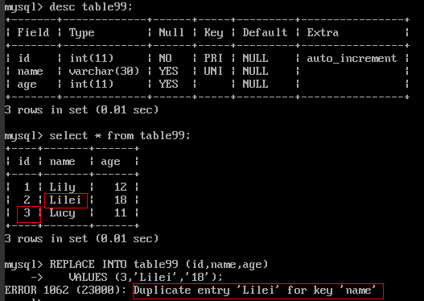
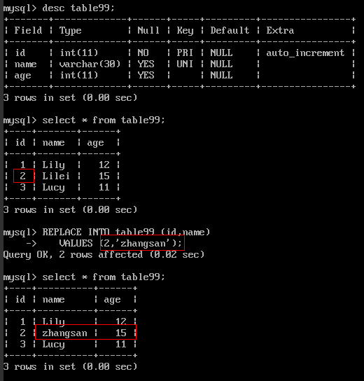

# SQL兼容性使用限制

由于分布式数据库中间件架构的限制，DDM对使用SQL有一些约束条件。

> **说明：**   
>-   当前版本仅支持在SQL语句中对当前连接库进行操作，不支持在SQL语句中对其他连接库进行操作，否则会导致异常结果。  
>-   由于分布式事务的特性，对于增、删、改等批量SQL操作，或者对全局表的增、删、改操作，都需要设置手动提交事务，以确保数据记录改动的准确无误。  
>    例如客户端在批量操作时，可进行如下设置：  
>    **set autocommit=0; **__  
>    _\{sql operations\};_  
>    **commit;**  

**表 1**  DDL的语法限制

<table><thead align="left"><tr id="row02321058416"><th class="cellrowborder" valign="top" width="18.91%" id="mcps1.2.3.1.1">
DDL语法

</th>
<th class="cellrowborder" valign="top" width="81.08999999999999%" id="mcps1.2.3.1.2">
限制条件

</th>
</tr>
</thead>
<tbody><tr id="row82321850419"><td class="cellrowborder" valign="top" width="18.91%" headers="mcps1.2.3.1.1 ">
DDL语法

</td>
<td class="cellrowborder" valign="top" width="81.08999999999999%" headers="mcps1.2.3.1.2 "><ul id="ubb8b407e553b4a579ef4856ccdcee810"><li>不支持修改分片字段（拆分键）。</li><li>不支持ALTER DATABASE Syntax。</li><li>不支持RENAME、ALTER等命令修改表名。</li><li>不支持ALTER命令修改拆分键和全局序列字段。</li><li class="msonormal">不支持创建TEMPORARY类型的分片表、全局表。</li><li class="msonormal">不支持从另一张表创建新的分片表、全局表。</li><li>仅单表支持外键，分片表和全局表不支持外键。</li><li>支持从另一张单表或全局表创建新的单表，但不支持从另一张分片表创建新的单表。</li><li>CREATE TABLE Syntax和DROP TABLE Syntax不支持注解，且不受参数sql_execute_timeout的限制。</li><li>支持if exists创建表，不支持if not exists event以及database。</li></ul>
</td>
</tr>
</tbody>
</table>

**表 2**  DML的语法限制

<table><thead align="left"><tr id="row12130165291015"><th class="cellrowborder" valign="top" width="18.87%" id="mcps1.2.3.1.1">
DML语法

</th>
<th class="cellrowborder" valign="top" width="81.13%" id="mcps1.2.3.1.2">
限制条件

</th>
</tr>
</thead>
<tbody><tr id="row1213015261016"><td class="cellrowborder" valign="top" width="18.87%" headers="mcps1.2.3.1.1 ">
INSERT语句

</td>
<td class="cellrowborder" valign="top" width="81.13%" headers="mcps1.2.3.1.2 "><ul id="ul7325172223219"><li>不支持不带字段的INSERT INTO语句。</li><li>不支持INSERT INTO ... SELECT ... FROM ...句式。</li></ul>
</td>
</tr>
<tr id="row17130195218109"><td class="cellrowborder" valign="top" width="18.87%" headers="mcps1.2.3.1.1 ">
DELETE语句

</td>
<td class="cellrowborder" valign="top" width="81.13%" headers="mcps1.2.3.1.2 "><ul id="ul27791957192211"><li>不支持多表删除。</li><li>不支持PARTITION子句。</li><li>不支持对分片表的ORDER BY + LIMIT组合。</li><li>不支持跨分片子查询。</li></ul>
</td>
</tr>
<tr id="row1113045251017"><td class="cellrowborder" valign="top" width="18.87%" headers="mcps1.2.3.1.1 ">
UPDATE语句

</td>
<td class="cellrowborder" valign="top" width="81.13%" headers="mcps1.2.3.1.2 "><ul id="ul1982132314211"><li>不支持涉及多表的UPDATE。</li><li>不支持对分片表的ORDER BY + LIMIT组合。</li><li>不支持跨分片子查询。</li><li>不支持分片键的更新。</li></ul>
</td>
</tr>
<tr id="row12130125291013"><td class="cellrowborder" valign="top" width="18.87%" headers="mcps1.2.3.1.1 ">
SELECT语句

</td>
<td class="cellrowborder" valign="top" width="81.13%" headers="mcps1.2.3.1.2 "><ul id="ul115591132152117"><li>不支持使用UNION查询。</li><li>不支持SELECT导出到文件。</li><li>不支持跨分片子查询。</li><li>ORDER BY的字段需要包括在前面的SELECT字段里。</li><li>不支持类似ORDER BY FIELD(id,1,2,3)这种自定义排序。</li></ul>
</td>
</tr>
<tr id="row2407104616218"><td class="cellrowborder" valign="top" width="18.87%" headers="mcps1.2.3.1.1 ">
REPLACE语句

</td>
<td class="cellrowborder" valign="top" width="81.13%" headers="mcps1.2.3.1.2 "><ul id="ul1643381032220"><li>当前REPLACE只支持以下语法：
replace into table(col1,col2,col3) values(value1,value2,value3);

</li><li>使用REPLACE语法的账号需要拥有INSERT和DELETE权限。</li><li>使用REPLACE语法的分片表，建议设拆分建为主键。</li><li>REPLACE在插入数据前，如果新增行的唯一约束和多条旧数据的唯一约束相同，原生REPLACE会把所有相同的唯一约束行删除，并重新插入数据，但DDM中的REPLACE语法会报错，提示无法执行插入操作。
示例：

<b>图1 </b>REPLACE语法使用示例一 

</li><li>REPLACE在插入数据时，如果新增行的唯一约束和旧数据的唯一约束不相同，则会插入新增行数据；如果新增行的唯一约束和旧数据中的唯一约束相同，但其他字段的值不相同，原生REPLACE不保留旧数据中的值，但DDM中REPLACE语法会保留。
示例：

<b>图2 </b>REPLACE语法使用示例二 

</li></ul>
</td>
</tr>
<tr id="row23324446217"><td class="cellrowborder" valign="top" width="18.87%" headers="mcps1.2.3.1.1 ">
JOIN表达式

</td>
<td class="cellrowborder" valign="top" width="81.13%" headers="mcps1.2.3.1.2 ">
JOIN表达式的表之间的拆分规范相同。

DDM会对sql中出现的每张表计算各自的路由，然后将每张表的路由求交集。

<ul id="ul78621144102315"><li>如果交集为空，则DDM不支持。</li><li>如果交集有多个节点，且JOIN两侧的表类型不一样，若分片表在JOIN左侧，则不支持RIGHT JOIN；若分片表在JOIN右侧，则不支持LEFT JOIN。</li><li>如果分片表带有非IS NULL的过滤条件，则任意一个JOIN的方向无限制。</li><li>不支持同一张分片表使用多个别名进行自关联。</li><li>不支持跨分片JOIN。</li></ul>
</td>
</tr>
<tr id="row143842152115"><td class="cellrowborder" valign="top" width="18.87%" headers="mcps1.2.3.1.1 ">
系统库查询

</td>
<td class="cellrowborder" valign="top" width="81.13%" headers="mcps1.2.3.1.2 ">
支持以下系统库查询：

SELECT version()

<ul id="ul49641149142419"><li>information_schema.SCHEMA_PRIVILEGES</li><li>information_schema.TABLE_PRIVILEGES</li><li>information_schema.USER_PRIVILEGES</li><li>information_schema.SCHEMATA</li><li>information_schema.tables</li><li>information_schema.columns</li></ul>

SHOW KEYS FROM `table ` FROM `database

 说明： 
<ul id="ul8970154932412"><li>仅支持=、in、like三种操作符，和and条件关联。</li><li>不支持子查询、关联查询、排序、聚合查询、LIMIT等等复杂查询。</li><li>information_schema.tables和information_schema.columns支持&lt;&gt;操作符。</li></ul>

</td>
</tr>
</tbody>
</table>

**表 3**  函数的限制

<table><thead align="left"><tr id="row28671958145418"><th class="cellrowborder" valign="top" width="18.91%" id="mcps1.2.3.1.1">
函数

</th>
<th class="cellrowborder" valign="top" width="81.08999999999999%" id="mcps1.2.3.1.2">
限制条件

</th>
</tr>
</thead>
<tbody><tr id="row10867115815410"><td class="cellrowborder" valign="top" width="18.91%" headers="mcps1.2.3.1.1 ">
函数

</td>
<td class="cellrowborder" valign="top" width="81.08999999999999%" headers="mcps1.2.3.1.2 "><ul id="ul20868185805411"><li>分片表不支持内层函数是聚合函数的嵌套函数调用，如：select concat(sum(yan),'') from shenhai，结果会和预期不一样。</li><li>分片表不支持group_concat行转列函数，执行结果会和预期不一样。</li><li>不支持在SQL语句中对非当前连接库进行操作。</li><li>聚合函数如count(*)，如果需要在order by，having中使用，请加上别名。
例如：select count(*) as alias from tbl order by alias

</li></ul>
</td>
</tr>
</tbody>
</table>

**表 4**  全局系列的的限制

<table><thead align="left"><tr id="row1859074215294"><th class="cellrowborder" valign="top" width="18.91%" id="mcps1.2.3.1.1">
全局系列

</th>
<th class="cellrowborder" valign="top" width="81.08999999999999%" id="mcps1.2.3.1.2">
限制条件

</th>
</tr>
</thead>
<tbody><tr id="row125901142182919"><td class="cellrowborder" valign="top" width="18.91%" headers="mcps1.2.3.1.1 ">
全局系列

</td>
<td class="cellrowborder" valign="top" width="81.08999999999999%" headers="mcps1.2.3.1.2 ">
单表不支持全局系列（包括基于DB的全局序列和基于时间的全局序列）。

</td>
</tr>
</tbody>
</table>

**表 5**  数据库管理语句的限制

<table><thead align="left"><tr id="row1359552215619"><th class="cellrowborder" valign="top" width="18.91%" id="mcps1.2.3.1.1">
数据库管理语句

</th>
<th class="cellrowborder" valign="top" width="81.08999999999999%" id="mcps1.2.3.1.2">
限制条件

</th>
</tr>
</thead>
<tbody><tr id="row1059552214563"><td class="cellrowborder" valign="top" width="18.91%" headers="mcps1.2.3.1.1 ">
数据库管理语句

</td>
<td class="cellrowborder" valign="top" width="81.08999999999999%" headers="mcps1.2.3.1.2 "><ul id="u6486dcb468cb43ae91255d0c62dba963"><li class="msonormal">不支持SET Syntax修改全局变量。</li><li>不支持SHOW TRIGGERS语法。</li><li>不支持SHOW TABLE STATUS语法。</li></ul>

下列的SHOW指令会随机发到某个物理分片，每个物理分片如果在不同的RDS上，查得的变量或者表信息可能不同：

<ul id="zh-cn_topic_0077295701_ul7281275257"><li class="msonormal">SHOW TABLE STATUS</li><li>SHOW VARIABLES Syntax</li></ul>
</td>
</tr>
</tbody>
</table>

**表 6**  SQL高级功能的限制

<table><thead align="left"><tr id="row185011158101618"><th class="cellrowborder" valign="top" width="18.91%" id="mcps1.2.3.1.1">
SQL高级功能

</th>
<th class="cellrowborder" valign="top" width="81.08999999999999%" id="mcps1.2.3.1.2">
限制条件

</th>
</tr>
</thead>
<tbody><tr id="row6501115814168"><td class="cellrowborder" valign="top" width="18.91%" headers="mcps1.2.3.1.1 ">
SQL高级功能

</td>
<td class="cellrowborder" valign="top" width="81.08999999999999%" headers="mcps1.2.3.1.2 "><ul id="zh-cn_topic_0077295716_ul20319837651"><li>暂不支持Prepare\EXECUTE语法。</li><li>暂不支持用户自定义数据类型、自定义函数。</li><li>暂不支持视图、存储过程、触发器、游标。</li><li>暂不支持 BEGIN…END、LOOP…END LOOP、REPEAT…UNTIL…END REPEAT、WHILE…DO…END WHILE 等复合语句。</li><li>暂不支类似 IF ，WHILE 等流程控制类语句。</li><li>暂不支持的预处理类型：<pre class="codeblock" id="cef9bbff750364676a9bea5dc93ce919e">PREPARE Syntax</pre>
<pre class="codeblock" id="c5ff0a3f6f082447cb47dfdaf3f78be06">EXECUTE Syntax</pre>
</li><li>不支持在建表语句中，对索引增加COMMENT形式的注释。</li><li>不支持进行用户权限相关的设置。
例如grant all on *.* to 'test'@'%' identified by 'test123'等用户权限设置均不支持，请在前台console设置。

</li></ul>
</td>
</tr>
</tbody>
</table>

