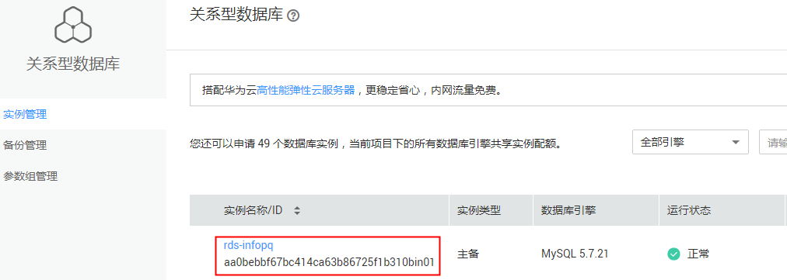
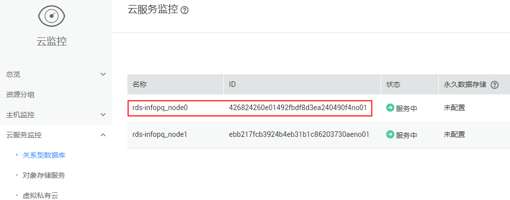
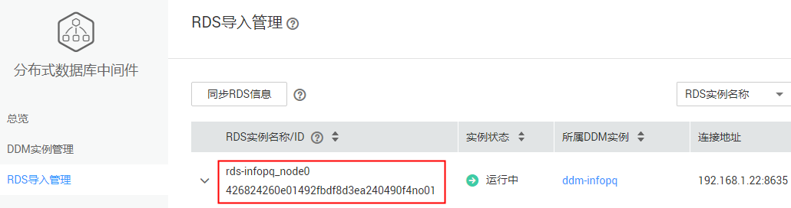

# DDM控制台显示的RDS实例名称/ID和RDS控制台显示的RDS实例名称/ID为什么不同

DDM基于RDS的OpenAPI，RDS实例名称/ID为导入RDS时从RDS获取的RDS实例名称/ID，DDM显示的RDS实例名称采用RDS实例名称加后缀方式命名，RDS实例名称/ID可在RDS的“查看监控”中查阅。

例如：

RDS上的实例名称为"rds-infopq"（[图1](#fig374412437449)），对应DDM上显示的RDS实例名称为“rds-infopq\_node0”（[图3](#fig0641132618474)）。

DDM上显示的RDS实例名称/ID（[图3](#fig0641132618474)），与RDS“查看监控”中的节点名称/ID（[图2](#fig16941907468)）相对应。

## RDS实例ID

在RDS管理控制台，左侧导航单击“实例管理”，[图1](#fig374412437449)红框所示即为RDS实例ID。

**图 1**  RDS实例名称/ID  

## RDS节点名称/ID

在RDS管理控制台，在任一实例右操作列选择“更多 \> 查看监控”，并在左侧导航选择“关系型数据库”。

[图2](#fig16941907468)中红框所示即为RDS节点名称/ID。

**图 2**  RDS节点名称/ID  

## DDM实例名称/ID

DDM中的RDS实例名称/ID（[图3](#fig0641132618474)）为实例名称所对应的RDS节点名称/ID（[图2](#fig16941907468)）。

**图 3**  DDM实例名称/ID  

