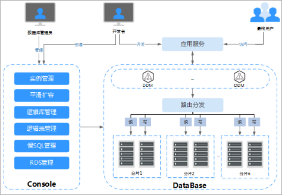
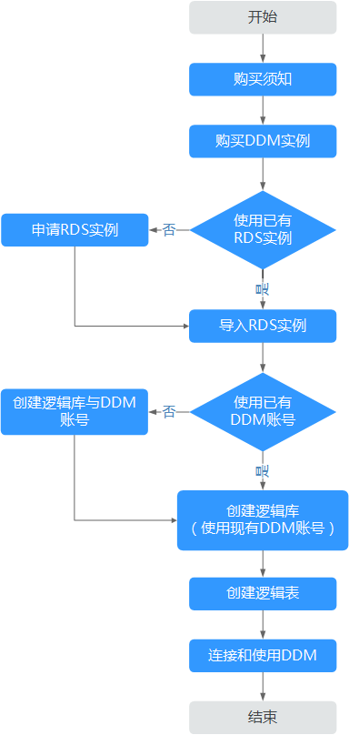

# 产品架构

DDM作为数据库中间件，将底层数据库存储引擎以集群方式管理起来，用户使用非常方便。

应用程序不需要关心具体有多少分片。类似操作单机数据库，用户通过DDM管理控制台进行数据库运维，使用JDBC等驱动服务或MySQL客户端等方式连接数据库，进行数据读写。

DDM服务的业务架构如图所示。

**图 1**  DDM业务架构  

-   开发者通过DDM管理控制台购买DDM实例、创建逻辑库、逻辑表和DDM账号，完成数据库中间件的部署。
-   开发者将开发的应用服务部署在与DDM相同VPC下的弹性云服务器上。
-   应用服务与DDM建立连接，在用户访问过程中，应用服务通过DDM进行数据读写操作。
-   数据库管理员通过DDM管理控制台进行数据库运维。
-   RDS实例需要由用户在RDS服务上购买，购买后导入到DDM服务中。
-   DDM在创建逻辑库时，需要将RDS实例关联到逻辑库。

## 使用流程

分布式数据库中间件的使用分为两步，首先需要购买服务，然后才能配置使用服务。

1.  购买服务

    DDM提供了Web化的服务管理平台，支持通过管理控制台申请。用户可直接登录管理控制台，从主页选择“数据库\>分布式数据库中间件”，购买分布式数据库中间件实例。如果您有自己的统一运维前端，您可以通过API调用，将DDM相关服务集成到您的统一运维平台中。

2.  配置服务

    成功购买分布式数据库中间件实例后，您需要按照本手册的入门章节，使用配置DDM服务。操作流程如下：导入（已购买的）RDS实例，创建逻辑库以及逻辑表，并通过SQL客户端、JDBC、PHP等方式连接DDM，具体流程见[图2](#fig9894181019309)。

    > **说明：**   
    >DDM实例提供多个连接地址，确保连接的稳定。应用连接数据库时，建议配置负载均衡方式。  

    **图 2**  DDM配置流程  
    

