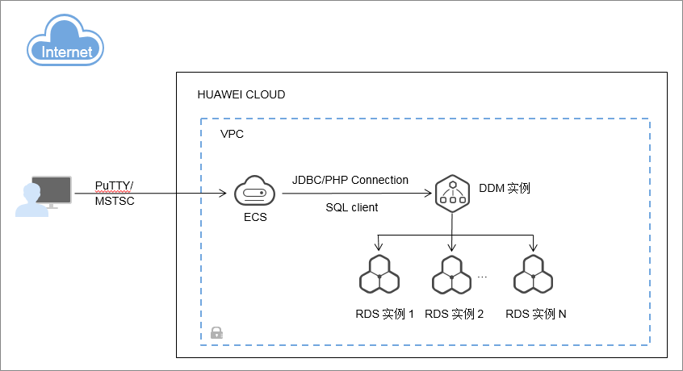

# 什么是分布式数据库中间件

分布式数据库中间件（Distributed Database Middleware，简称DDM），使用云数据库（RDS）作为存储引擎，具备自动部署、分库分表、弹性伸缩、高可用等全生命周期运维管控能力。专注于解决数据库分布式扩展问题，突破了传统数据库的容量和性能瓶颈，实现海量数据高并发访问。

**图 1**  DDM实现原理  

> **说明：**   
>出于安全考虑，推荐从弹性云服务器（Elastic Cloud Server，简称ECS）访问分布式数据库中间件，二者必须在同一虚拟私有云（Virtual Private Cloud，简称VPC）中。  

## 产品优势

分布式数据库中间件（简称DDM）具有无限扩容、性能卓越、简单易用、快速部署、低成本等优势。

-   **无限扩容**
    -   自动水平拆分。
    -   支持字符串、数字、日期等多种纬度。
    -   业务不中断平滑扩容。

-   **性能卓越**

    性能通过水平扩展可线性提升。

-   **简单易用**
    -   兼容MySQL协议、语法、客户端。
    -   轻松数据导入，数据库上云。
    -   一键实现数据库扩容。
    -   业务零代码改动，实现读写分离。

-   **快速部署**

    可在线快速部署实例，节省采购、部署、配置等自建数据库工作，缩短项目周期，帮助业务快速上线。

-   **低成本**

    稳定的产品，完善的运维和技术支持，相比开源产品总体性价比更高；多种实例规格配置覆盖不同业务规模场景，按需购买。

## DDM相对于单机关系型数据库的优势

DDM解决了单机关系型数据库对硬件依赖性强、扩展能力有限、数据量增大后扩容困难、数据库响应变慢等难题，通过分布式集群架构方案实现了“平滑扩容”，扩容过程中保持业务不中断。

-   **数据分布式存储**

    DDM采用水平拆分方式，将数据记录数庞大的单表，按指定的拆分规则，分布式存储到各个分片中。同时DDM提供路由分发功能，应用服务无需考虑数据该写入哪个分片，该从哪个分片读取。

-   **读写分离**

    用户可以根据数据读取压力负载情况，为每个RDS实例配置一个或者多个只读实例，提高查询并发性能。

-   **高性能**

    在实际业务访问中，SQL主要的性能瓶颈集中在物理数据库节点上。

    DDM实例关联多个RDS节点，减少单个RDS存储的数据量，同时实现并行计算，支持PB级数据量访问，以及百万级高并发。

-   **在线平滑扩容**

    DDM在不中断业务的情况下，支持新增RDS实例，水平扩容存储空间。一键式扩容，轻松解决单机关系型数据库的容量瓶颈。

