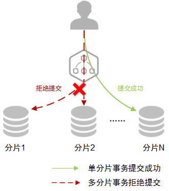
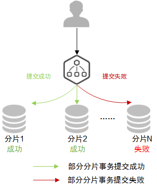

# 分布式事务

分布式数据库中间件当前支持单机、最大努力提交、最终原子性三种分布式事务模型。

各分布式事务模型相关介绍如[表1](#table10280154962418)所示。

**表 1**  分布式事务模型特点

<table><thead align="left"><tr id="row2281124992414"><th class="cellrowborder" valign="top" width="15%" id="mcps1.2.4.1.1">
事务模型

</th>
<th class="cellrowborder" valign="top" width="41%" id="mcps1.2.4.1.2">
优势

</th>
<th class="cellrowborder" valign="top" width="44%" id="mcps1.2.4.1.3">
不足

</th>
</tr>
</thead>
<tbody><tr id="row2028111498246"><td class="cellrowborder" valign="top" width="15%" headers="mcps1.2.4.1.1 ">
单机

</td>
<td class="cellrowborder" valign="top" width="41%" headers="mcps1.2.4.1.2 ">
执行效率高，由底层数据库提供强一致性的保证。

</td>
<td class="cellrowborder" valign="top" width="44%" headers="mcps1.2.4.1.3 ">
如果事务涉及到多分片，DDM将拒绝执行，返回错误。

</td>
</tr>
<tr id="row19281194922412"><td class="cellrowborder" valign="top" width="15%" headers="mcps1.2.4.1.1 ">
最大努力提交

</td>
<td class="cellrowborder" valign="top" width="41%" headers="mcps1.2.4.1.2 ">
支持跨分片事务，执行结果相对独立，互不干涉。

</td>
<td class="cellrowborder" valign="top" width="44%" headers="mcps1.2.4.1.3 ">
执行效率低于单机。

如果有分片提交失败时，不提供事务补偿，因此会出现部分执行成功部分执行失败。

</td>
</tr>
<tr id="row1628144982419"><td class="cellrowborder" valign="top" width="15%" headers="mcps1.2.4.1.1 ">
最终原子性

</td>
<td class="cellrowborder" valign="top" width="41%" headers="mcps1.2.4.1.2 ">
支持跨分片事务，且保证各分片事务最终执行结果一致。

</td>
<td class="cellrowborder" valign="top" width="44%" headers="mcps1.2.4.1.3 ">
执行效率低于最大努力提交。

如果有分片提交失败时，会进行事务补偿，事务补偿阶段，客户端查询结果不是最新结果（即存在中间状态）。

</td>
</tr>
</tbody>
</table>

> **说明：**   
>-   DDM的分布式事务模型建立在逻辑库层面上，一个逻辑库只能选择一种事务模型。在创建逻辑库时需要规划好存储的数据结构与SQL的需求，如是否需要跨分片，根据需求选择合适的分布式事务模型。  
>-   目前自定义hint类型只支持select和update语句。  
>-   在最终原子性场景下，建议不要删除表中字段或在已有字段中添加字段。若能确认当前事务未出异常或已正常回滚补偿完毕，则可以添加字段，添加时请在表字段的最后进行追加。  

## 单机

**基本概述**

只能在单个分片上执行，如果事务涉及到多分片，DDM将拒绝执行，返回错误。原理如[图1](#fig1252652193612)所示。

**适用场景**

适合业务拆分比较合理，在应用层有独自完善的事务处理框架，到DDM的事务都是单分片事务，单分片事务由底层数据库提供强一致性的保证。单机事务模型下，如果出现跨分片的事务，会报错进行提示，避免达不到预期目的。

**图 1**  单机  

## 最大努力提交

**基本概述**

事务在各分片上分别提交，互不干涉，提交结果尽最大可能保持一致，但有部分提交成功部分提交失败的可能，原理如[图2](#fig8409440114517)所示。

**适用场景**

这种分布式事务适合绝大部分不涉及金钱往来的业务，在性能和一致性之间比较好的一个平衡。事务中的commit往多个节点发送执行，有部分commit成功部分commit失败的可能性，但是这种情况出现的可能性比较低，只有在commit的时间窗内出现异常才有可能出现。

**图 2**  最大努力提交  

## 最终原子性

**基本概述**

事务在各分片上的提交结果不保证始终一致，如果有分片提交失败，DDM会对其他提交成功的分片提供补偿机制撤消之前的修改，从而确保各分片事务状态最终一致。

> **说明：**   
>最终原子性场景下，如有并发的查询请求，查询到的结果可能不是最终状态，如部分分片已完成提交，部分分片还在提交中，即存在中间状态。  

**适用场景**

适合对一致性要求比较高的场景，最终原子性解决了最大努力提交模型下部分commit成功部分失败的问题。如果对部分读的sql一致性要求比较高，还可以通过**select for update**或者**lock in share mode**来避免读取到不一致状态（部分成功部分失败）。

例如：

**select col1, col2,...coln from table1 where  **col1**=\{拆分键\} for update;**

**select col1, col2,...coln from table1 where  **col1**=\{拆分键\}  **lock in share mode**;**

where条件中建议带上拆分键。

