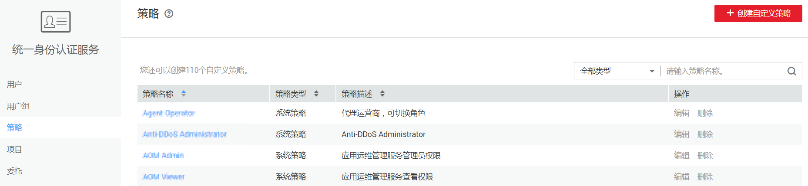
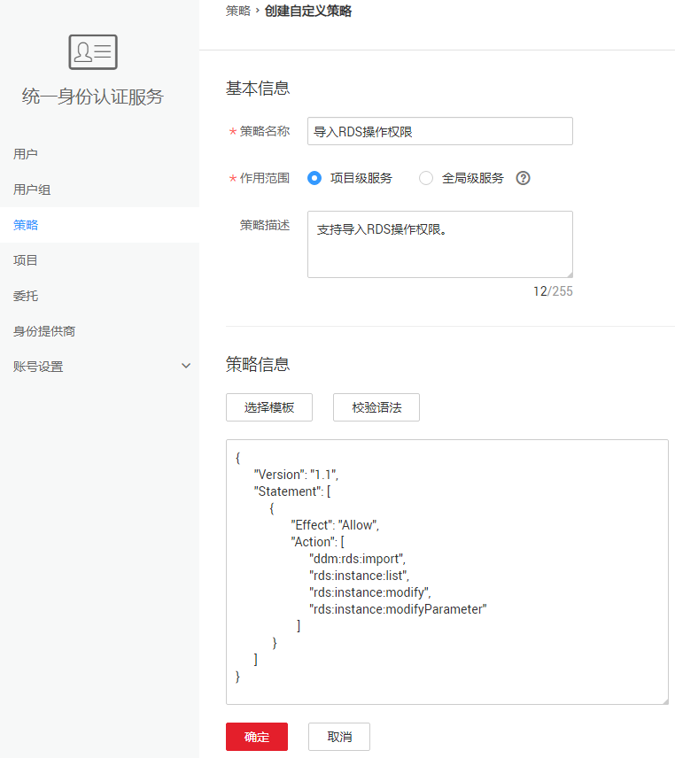

# 创建DDM自定义策略<a name="ddm_05_0004"></a>

如果系统预置的DDM权限，不满足您的授权要求，可以创建自定义策略。自定义策略中可以添加的授权项（Action）请参考：[策略及授权项说明](https://support.huaweicloud.com/api-ddm/ddm_12_0001.html)__。

## 前提条件<a name="section139931454105415"></a>

-   请先在IAM控制台中开通细粒度策略，开通方法请参见：[申请细粒度访问控制公测](https://support.huaweicloud.com/usermanual-iam/iam_01_019.html)。
-   自定义策略需要编写策略（JSON格式），请您先熟悉策略结构，具体请参见[细粒度策略](细粒度策略.md)。
-   请确定自定义策略需要允许哪些操作，拒绝哪些操作，并获取操作对应的授权项。授权项请参见：[策略及授权项说明](https://support.huaweicloud.com/api-ddm/ddm_12_0001.html)。

## 操作步骤<a name="section151455155417"></a>

如下以创建名为“导入RDS操作权限”的策略为例，创建一个支持导入RDS操作权限的自定义策略。

1.  登录统一身份认证管理控制台。
2.  在左侧导航栏中选择“策略“页签，然后单击页面右上角的“创建自定义策略“。

    **图 1**  创建自定义策略<a name="fig28833101232"></a>  
    

3.  在“创建自定义策略”页面，填选“基本信息“和“策略信息“。

    **图 2**  设置参数<a name="fig20410124812509"></a>  
    

    -   策略名称：填写“导入RDS操作权限“。
    -   作用范围：根据服务的属性填写。DDM为项目级服务，选择“项目级服务“。
    -   策略信息：将如下内容拷贝至策略信息中，并单击“检验语法”。如下策略表示支持导入RDS操作权限。

        ```
        {
              "Version": "1.1",
              "Statement": [
                    {
                          "Effect": "Allow",
                          "Action": [
                                "ddm:rds:import",
                                "rds:instance:list",
                                "rds:instance:modify",
                                "rds:instance:modifyParameter"                   
                          ]
                    }
              ]
        }
        ```

4.  参数设置完成后，单击“确定“，创建自定义策略。
5.  将新创建的自定义策略授予用户组，使得用户组中的用户具备自定义策略定义的权限：导入RDS操作的权限。
6.  用户登录并验证自定义策略定义的权限。

    权限授予成功后，用户可以通过控制台以及REST API等多种方式验证。此处以登录控制台为例，介绍用户如何验证导入RDS操作的权限。

    1.  使用新创建的用户登录华为云，登录方法选择为“IAM用户登录”。
        -   账号名为该IAM用户所属华为云账号的名称。
        -   用户名和密码为账号在IAM创建用户时输入的用户名和密码。

    2.  在分布式数据库中间件服务页面，进行导入RDS操作，操作成功，则权限配置正确并已生效。
    3.  尝试进行其他操作，例如：创建DDM实例。

        系统显示“权限不足”，则权限配置正确并已生效。


## 策略样例<a name="section1812555125418"></a>

-   **示例1：导入RDS操作**

    ```
    {
          "Version": "1.1",
          "Statement": [
                {
                      "Effect": "Allow",
                      "Action": [
                            "ddm:rds:import",
                            "rds:instance:list",
                            "rds:instance:modify",
                            "rds:instance:modifyParameter"                   
                      ]
                }
          ]
    }
    ```

-   **示例2：拒绝用户删除DDM实例**

    拒绝策略需要同时配合其他策略使用，否则没有实际作用。用户被授予的策略中，一个授权项的作用如果同时存在Allow和Deny，则遵循Deny优先。拒绝策略示例如下：

    ```
    { 
          "Version": "1.1", 
          "Statement": [ 
                { 
               "Effect": "Deny", 
                      "Action": [ 
                            "ddm:instance:delete" 
                      ] 
                } 
          ] 
    }
    ```


