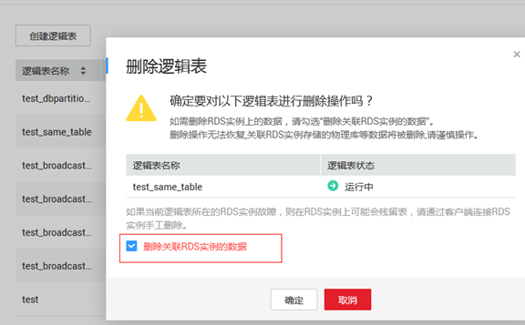
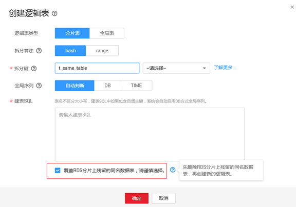

# 创建逻辑表时提示RDS分片上有残留的同名表怎么办<a name="ddm_04_0027"></a>

本章节分别描述在控制台和客户端创建逻辑表时提示RDS分片上有残留的同名表的处理方法。

## 控制台创建表<a name="section11574192118421"></a>

-   问题现象：

    在DDM管理控制台创建逻辑表时提示，RDS实例分片中已存在同名数据表。错误码：DDM.4208。

-   解决方法：
    1.  若确认该表并未使用，可先执行删除，同时勾选“删除关联RDS实例的数据”，再重新创建。

        **图 1**  删除逻辑库<a name="fig1854319237125"></a>  
        

    2.  若删除时未勾选“删除关联RDS实例的数据”，可在重建时勾选“覆盖RDS分片上残留的同名表”。

        **图 2**  创建逻辑表<a name="fig10350154031215"></a>  
        


## 客户端创建表<a name="section1558893319454"></a>

-   问题现象：

    通过MySQL客户端连接到DDM创建分片表或全局表，返回表已存在的提示，如下：

    ```
    mysql> CREATE TABLE test_broadcast_all_01 (id int, name varchar(30), primary key(id)) BROADCAST;
    ERROR 1005 (HY000): Can't create table 'test_broadcast_all_01'. "A data table with the same name already exists in the shard of the RDS DB instance."
    ```

-   解决方法：
    1.  若确认该表并未使用，可使用**DROP TABLE**语句先删除，**DROP TABLE**会删除当前逻辑库所有关联分片上残留的同名表。

        ```
        mysql> drop table test_broadcast_all_01;
        Query OK, 0 rows affected (2.45 sec)
        ```

    2.  重新创建该表。

        ```
        mysql> CREATE TABLE test_broadcast_all_01 (id int, name varchar(30), primary key(id)) BROADCAST;
        Query OK, 0 rows affected (3.64 sec)
        ```


