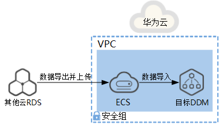

# 场景三：其他云RDS迁移到DDM<a name="ddm_03_0026"></a>

## 场景介绍<a name="section76835514115"></a>

企业当前使用其他云RDS，希望能使用华为云DDM将数据进行分布式存储。

> **说明：**   
>迁移过程中可能会出现业务中断情况，中断时长与迁移数据量大小、网络情况相关。  

## 迁移示意<a name="section95341358122"></a>

**图 1**  其他云RDS迁移到DDM示意图<a name="fig157851434251"></a>  


## 约束限制<a name="section3182459171113"></a>

-   目标DDM实例、RDS实例所在ECS必须保证网络互通。
-   为了保持数据完整性，需要先停止业务后再进行数据迁移。
-   DDM不支持以自动新建库或者新建分片表、全局表的方式导入数据。因此导入数据前需要先创建好相同名称的逻辑库，相同分片表、全局表结构的逻辑表，然后再进行数据导入。各类逻辑表创建方式请参见[表2](#table0310181114492)。
-   目标DDM使用的RDS（MySQL）与其他云RDS的MySQL版本需要保持一致。

## 迁移前准备<a name="section1589351081218"></a>

-   准备可以访问其他云RDS、目标DDM实例，目标RDS实例的ECS。
    1.  确保其他云RDS和目标DDM实例、RDS实例都与ECS网络互通。如果网络不通，数据导出后，通过其他中转服务器，将数据文件上传到华为云ECS。
    2.  ECS已安装MySQL官方客户端，MySQL客户端版本建议为5.6或5.7。
        -   Redhat系列Linux安装命令：**yum install mysql mysql-devel**
        -   Debian系列Linux安装命令：**apt install mysql-client-5.7 mysql-client-core-5.7**

    1.  ECS磁盘空间足够存放临时转储文件；ECS内存空间足够，可以用来比较转储文件。


-   准备DDM实例，并配置DDM账号、DDM逻辑库、DDM逻辑表等相关信息。
    1.  申请DDM实例，并在DDM控制台创建DDM账号、创建逻辑库。
    2.  <a name="li1477720981213"></a>导出其他云RDS数据表结构至SQL文本文件。

        ```
        mysqldump -h {DB_ADDRESS} -P {DB_PORT} -u {DB_USER} -p --single-transaction --hex-blob --set-gtid-purged=OFF --no-data --order-by-primary {DB_NAME} {TABLE_NAME} > {mysql_table_schema.sql}
        ```

        相关参数解释如[表1](#table712163823911)所示。

        **表 1**  参数解释

        <a name="table712163823911"></a>
        <table><thead align="left"><tr id="row17251387393"><th class="cellrowborder" valign="top" width="34%" id="mcps1.2.4.1.1"><p id="p129338203911"><a name="p129338203911"></a><a name="p129338203911"></a>参数</p>
        </th>
        <th class="cellrowborder" valign="top" width="31%" id="mcps1.2.4.1.2"><p id="p203213853917"><a name="p203213853917"></a><a name="p203213853917"></a>说明</p>
        </th>
        <th class="cellrowborder" valign="top" width="35%" id="mcps1.2.4.1.3"><p id="p63583803920"><a name="p63583803920"></a><a name="p63583803920"></a>备注</p>
        </th>
        </tr>
        </thead>
        <tbody><tr id="row16397386391"><td class="cellrowborder" valign="top" width="34%" headers="mcps1.2.4.1.1 "><p id="p114203833913"><a name="p114203833913"></a><a name="p114203833913"></a>DB_ADDRESS</p>
        </td>
        <td class="cellrowborder" valign="top" width="31%" headers="mcps1.2.4.1.2 "><p id="p1461338173916"><a name="p1461338173916"></a><a name="p1461338173916"></a>待导出数据的数据库连接地址。</p>
        </td>
        <td class="cellrowborder" valign="top" width="35%" headers="mcps1.2.4.1.3 "><p id="p94953813911"><a name="p94953813911"></a><a name="p94953813911"></a>必填</p>
        </td>
        </tr>
        <tr id="row1651338153918"><td class="cellrowborder" valign="top" width="34%" headers="mcps1.2.4.1.1 "><p id="p135503818398"><a name="p135503818398"></a><a name="p135503818398"></a>DB_PORT</p>
        </td>
        <td class="cellrowborder" valign="top" width="31%" headers="mcps1.2.4.1.2 "><p id="p135953813911"><a name="p135953813911"></a><a name="p135953813911"></a>数据库侦听端口</p>
        </td>
        <td class="cellrowborder" valign="top" width="35%" headers="mcps1.2.4.1.3 "><p id="p56313843910"><a name="p56313843910"></a><a name="p56313843910"></a>必填</p>
        </td>
        </tr>
        <tr id="row126512388393"><td class="cellrowborder" valign="top" width="34%" headers="mcps1.2.4.1.1 "><p id="p1868338183912"><a name="p1868338183912"></a><a name="p1868338183912"></a>DB_USER</p>
        </td>
        <td class="cellrowborder" valign="top" width="31%" headers="mcps1.2.4.1.2 "><p id="p2701338103910"><a name="p2701338103910"></a><a name="p2701338103910"></a>数据库用户</p>
        </td>
        <td class="cellrowborder" valign="top" width="35%" headers="mcps1.2.4.1.3 "><p id="p278538113913"><a name="p278538113913"></a><a name="p278538113913"></a>必填</p>
        </td>
        </tr>
        <tr id="row158043812399"><td class="cellrowborder" valign="top" width="34%" headers="mcps1.2.4.1.1 "><p id="p38313812397"><a name="p38313812397"></a><a name="p38313812397"></a>DB_NAME</p>
        </td>
        <td class="cellrowborder" valign="top" width="31%" headers="mcps1.2.4.1.2 "><p id="p985238193910"><a name="p985238193910"></a><a name="p985238193910"></a>数据库名称</p>
        </td>
        <td class="cellrowborder" valign="top" width="35%" headers="mcps1.2.4.1.3 "><p id="p589638123918"><a name="p589638123918"></a><a name="p589638123918"></a>必填</p>
        </td>
        </tr>
        <tr id="row791153883913"><td class="cellrowborder" valign="top" width="34%" headers="mcps1.2.4.1.1 "><p id="p1494163811391"><a name="p1494163811391"></a><a name="p1494163811391"></a>TABLE_NAME</p>
        </td>
        <td class="cellrowborder" valign="top" width="31%" headers="mcps1.2.4.1.2 "><p id="p697183810390"><a name="p697183810390"></a><a name="p697183810390"></a>表名</p>
        </td>
        <td class="cellrowborder" valign="top" width="35%" headers="mcps1.2.4.1.3 "><p id="p31001738133915"><a name="p31001738133915"></a><a name="p31001738133915"></a>可以多个同类型的表，用空格隔开。</p>
        <p id="p910118383392"><a name="p910118383392"></a><a name="p910118383392"></a>建议只导出与业务相关的表结构。</p>
        </td>
        </tr>
        <tr id="row1117173813391"><td class="cellrowborder" valign="top" width="34%" headers="mcps1.2.4.1.1 "><p id="p6120538133912"><a name="p6120538133912"></a><a name="p6120538133912"></a>mysql_table_schema.sql</p>
        </td>
        <td class="cellrowborder" valign="top" width="31%" headers="mcps1.2.4.1.2 "><p id="p3124113814398"><a name="p3124113814398"></a><a name="p3124113814398"></a>生成的表结构文件名。</p>
        </td>
        <td class="cellrowborder" valign="top" width="35%" headers="mcps1.2.4.1.3 "><p id="p18127183873919"><a name="p18127183873919"></a><a name="p18127183873919"></a>每次导出表结构时文件名不同。</p>
        <p id="p112815383394"><a name="p112815383394"></a><a name="p112815383394"></a>建议以“逻辑库名”+“_”+“逻辑表名”+“_”+“schema”格式命名，以免数据被覆盖。如mysql_table_schema.sql。</p>
        </td>
        </tr>
        <tr id="row61420388398"><td class="cellrowborder" valign="top" width="34%" headers="mcps1.2.4.1.1 "><p id="p13146338163918"><a name="p13146338163918"></a><a name="p13146338163918"></a>--single-transaction</p>
        </td>
        <td class="cellrowborder" valign="top" width="31%" headers="mcps1.2.4.1.2 "><p id="p0148238133917"><a name="p0148238133917"></a><a name="p0148238133917"></a>该选项在导出数据之前提交一个BEGIN SQL语句，BEGIN 不会阻塞任何应用程序且能保证导出时数据库的一致性状态。它只适用于多版本存储引擎，仅InnoDB。</p>
        </td>
        <td class="cellrowborder" valign="top" width="35%" headers="mcps1.2.4.1.3 "><p id="p12152638133915"><a name="p12152638133915"></a><a name="p12152638133915"></a>-</p>
        </td>
        </tr>
        <tr id="row17169738183917"><td class="cellrowborder" valign="top" width="34%" headers="mcps1.2.4.1.1 "><p id="p2173203819393"><a name="p2173203819393"></a><a name="p2173203819393"></a>--hex-blob</p>
        </td>
        <td class="cellrowborder" valign="top" width="31%" headers="mcps1.2.4.1.2 "><p id="p117519384397"><a name="p117519384397"></a><a name="p117519384397"></a>使用十六进制格式导出二进制字符串字段。如果有二进制数据就必须使用该选项。</p>
        </td>
        <td class="cellrowborder" valign="top" width="35%" headers="mcps1.2.4.1.3 "><p id="p19178163819391"><a name="p19178163819391"></a><a name="p19178163819391"></a>-</p>
        </td>
        </tr>
        <tr id="row1532145814117"><td class="cellrowborder" valign="top" width="34%" headers="mcps1.2.4.1.1 "><p id="p1915910594413"><a name="p1915910594413"></a><a name="p1915910594413"></a>--set-gtid-purged=OFF</p>
        </td>
        <td class="cellrowborder" valign="top" width="31%" headers="mcps1.2.4.1.2 "><p id="p91631759204120"><a name="p91631759204120"></a><a name="p91631759204120"></a>若使用的MySQL版本为5.6或5.7，则需要配置该参数。</p>
        </td>
        <td class="cellrowborder" valign="top" width="35%" headers="mcps1.2.4.1.3 "><p id="p116785919412"><a name="p116785919412"></a><a name="p116785919412"></a>若使用的MySQL版本低于5.6，则不需要配置该参数。</p>
        </td>
        </tr>
        <tr id="row161922385392"><td class="cellrowborder" valign="top" width="34%" headers="mcps1.2.4.1.1 "><p id="p181941638103911"><a name="p181941638103911"></a><a name="p181941638103911"></a>--no-data</p>
        </td>
        <td class="cellrowborder" valign="top" width="31%" headers="mcps1.2.4.1.2 "><p id="p151997380399"><a name="p151997380399"></a><a name="p151997380399"></a>不导出任何数据，只导出数据库表结构。</p>
        </td>
        <td class="cellrowborder" valign="top" width="35%" headers="mcps1.2.4.1.3 "><p id="p12203193883914"><a name="p12203193883914"></a><a name="p12203193883914"></a>导出表结构时使用。</p>
        </td>
        </tr>
        <tr id="row1620413382396"><td class="cellrowborder" valign="top" width="34%" headers="mcps1.2.4.1.1 "><p id="p192086380390"><a name="p192086380390"></a><a name="p192086380390"></a>--order-by-primary</p>
        </td>
        <td class="cellrowborder" valign="top" width="31%" headers="mcps1.2.4.1.2 "><p id="p2211438103914"><a name="p2211438103914"></a><a name="p2211438103914"></a>如果存在主键，或者第一个唯一键，对每个表的记录进行排序。</p>
        </td>
        <td class="cellrowborder" valign="top" width="35%" headers="mcps1.2.4.1.3 "><p id="p4215153883916"><a name="p4215153883916"></a><a name="p4215153883916"></a>-</p>
        </td>
        </tr>
        </tbody>
        </table>

        > **说明：**   
        >此处举例的参数为数据导出中常用的参数，由于MySQLdump参数无法逐一列举，如果存在个别参数调优等特殊情况，请在MySQL官网查询或咨询DDM技术支持人员。  

    3.  创建逻辑表。

        创建逻辑表结构请与[2](#li1477720981213)中导出的表结构保持一致，把源表映射到目标DDM实例逻辑表，明确对应表结构和表数据的迁移策略，如[表2](#table0310181114492)所示。

        > **说明：**   
        >创建前可先通过SQL语句：show create table  **\{TABLE\_NAME\}**查看其他云RDS中数据表结构。  

        **表 2**  表迁移策略

        <a name="table0310181114492"></a>
        <table><thead align="left"><tr id="row17311811154914"><th class="cellrowborder" valign="top" width="20.202020202020204%" id="mcps1.2.5.1.1"><p id="p19196248134920"><a name="p19196248134920"></a><a name="p19196248134920"></a>逻辑库类型</p>
        </th>
        <th class="cellrowborder" valign="top" width="20.202020202020204%" id="mcps1.2.5.1.2"><p id="p17196154874911"><a name="p17196154874911"></a><a name="p17196154874911"></a>逻辑表类型</p>
        </th>
        <th class="cellrowborder" valign="top" width="29.292929292929294%" id="mcps1.2.5.1.3"><p id="p6440145284916"><a name="p6440145284916"></a><a name="p6440145284916"></a>表结构迁移策略</p>
        </th>
        <th class="cellrowborder" valign="top" width="30.303030303030305%" id="mcps1.2.5.1.4"><p id="p19440195216497"><a name="p19440195216497"></a><a name="p19440195216497"></a>表数据迁移策略</p>
        </th>
        </tr>
        </thead>
        <tbody><tr id="row113112011134915"><td class="cellrowborder" valign="top" width="20.202020202020204%" headers="mcps1.2.5.1.1 "><p id="p171963487494"><a name="p171963487494"></a><a name="p171963487494"></a>拆分</p>
        </td>
        <td class="cellrowborder" valign="top" width="20.202020202020204%" headers="mcps1.2.5.1.2 "><p id="p101961248204918"><a name="p101961248204918"></a><a name="p101961248204918"></a>分片表</p>
        </td>
        <td class="cellrowborder" rowspan="2" valign="top" width="29.292929292929294%" headers="mcps1.2.5.1.3 "><p id="p344012528493"><a name="p344012528493"></a><a name="p344012528493"></a>在DDM控制台创建逻辑表。</p>
        </td>
        <td class="cellrowborder" rowspan="2" valign="top" width="30.303030303030305%" headers="mcps1.2.5.1.4 "><p id="p12440105224913"><a name="p12440105224913"></a><a name="p12440105224913"></a>连接DDM导入表数据。</p>
        </td>
        </tr>
        <tr id="row3311131174919"><td class="cellrowborder" valign="top" headers="mcps1.2.5.1.1 "><p id="p161961148174914"><a name="p161961148174914"></a><a name="p161961148174914"></a>拆分</p>
        </td>
        <td class="cellrowborder" valign="top" headers="mcps1.2.5.1.2 "><p id="p2019613481498"><a name="p2019613481498"></a><a name="p2019613481498"></a>全局表</p>
        </td>
        </tr>
        <tr id="row2311311174915"><td class="cellrowborder" valign="top" width="20.202020202020204%" headers="mcps1.2.5.1.1 "><p id="p161961148154919"><a name="p161961148154919"></a><a name="p161961148154919"></a>拆分</p>
        </td>
        <td class="cellrowborder" valign="top" width="20.202020202020204%" headers="mcps1.2.5.1.2 "><p id="p619617489492"><a name="p619617489492"></a><a name="p619617489492"></a>单表</p>
        </td>
        <td class="cellrowborder" rowspan="2" valign="top" width="29.292929292929294%" headers="mcps1.2.5.1.3 "><p id="p0147142414912"><a name="p0147142414912"></a><a name="p0147142414912"></a>直连RDS（MySQL）导入建表语句。</p>
        </td>
        <td class="cellrowborder" rowspan="2" valign="top" width="30.303030303030305%" headers="mcps1.2.5.1.4 "><p id="p118515262492"><a name="p118515262492"></a><a name="p118515262492"></a>直连RDS（MySQL）导入表数据。</p>
        </td>
        </tr>
        <tr id="row103111111496"><td class="cellrowborder" valign="top" headers="mcps1.2.5.1.1 "><p id="p11961848164910"><a name="p11961848164910"></a><a name="p11961848164910"></a>非拆分</p>
        </td>
        <td class="cellrowborder" valign="top" headers="mcps1.2.5.1.2 "><p id="p1419674813497"><a name="p1419674813497"></a><a name="p1419674813497"></a>普通表</p>
        </td>
        </tr>
        </tbody>
        </table>

    1.  清理目标DDM实例的测试数据，防止和待迁移数据冲突。

-   准备RDS实例。

## 导出数据<a name="section0244151713536"></a>

从其他云RDS中将表数据导出到单独的SQL文本文件中，然后上传至ECS。

1.  停止自其他云RDS的业务系统，否则可能会导致导出数据不是最新的。
2.  导出其他云RDS表数据至SQL文本文件。

    ```
    mysqldump -h {DB_ADDRESS} -P {DB_PORT} -u {DB_USER} -p --single-transaction --hex-blob --complete-insert --set-gtid-purged=OFF --quick --no-create-info --skip-comments --skip-lock-tables --add-locks=false [--where=""] {DB_NAME}{TABLE_NAME} > {mysq_table_data.sql}
    ```

    > **说明：**   
    >-   如果其他云RDS中有多个逻辑库，建议分开多次执行该命令导出表数据。  
    >-   如果其他云RDS不支持mysqldump导出表数据方式，请联系技术支持协助处理。  

    相关参数解释如[表3](#table63608478103)所示。

    **表 3**  参数解释

    <a name="table63608478103"></a>
    <table><thead align="left"><tr id="row0652184719100"><th class="cellrowborder" valign="top" width="34%" id="mcps1.2.4.1.1"><p id="p9652447181012"><a name="p9652447181012"></a><a name="p9652447181012"></a>参数</p>
    </th>
    <th class="cellrowborder" valign="top" width="31%" id="mcps1.2.4.1.2"><p id="p126523472107"><a name="p126523472107"></a><a name="p126523472107"></a>说明</p>
    </th>
    <th class="cellrowborder" valign="top" width="35%" id="mcps1.2.4.1.3"><p id="p196576474103"><a name="p196576474103"></a><a name="p196576474103"></a>备注</p>
    </th>
    </tr>
    </thead>
    <tbody><tr id="row1665714472104"><td class="cellrowborder" valign="top" width="34%" headers="mcps1.2.4.1.1 "><p id="p1765734715101"><a name="p1765734715101"></a><a name="p1765734715101"></a>DB_ADDRESS</p>
    </td>
    <td class="cellrowborder" valign="top" width="31%" headers="mcps1.2.4.1.2 "><p id="p66570475103"><a name="p66570475103"></a><a name="p66570475103"></a>待导出数据的数据库连接地址。</p>
    </td>
    <td class="cellrowborder" valign="top" width="35%" headers="mcps1.2.4.1.3 "><p id="p14657124741020"><a name="p14657124741020"></a><a name="p14657124741020"></a>必填</p>
    </td>
    </tr>
    <tr id="row6657747131013"><td class="cellrowborder" valign="top" width="34%" headers="mcps1.2.4.1.1 "><p id="p16657647181010"><a name="p16657647181010"></a><a name="p16657647181010"></a>DB_PORT</p>
    </td>
    <td class="cellrowborder" valign="top" width="31%" headers="mcps1.2.4.1.2 "><p id="p26571847181017"><a name="p26571847181017"></a><a name="p26571847181017"></a>数据库侦听端口</p>
    </td>
    <td class="cellrowborder" valign="top" width="35%" headers="mcps1.2.4.1.3 "><p id="p1265704781015"><a name="p1265704781015"></a><a name="p1265704781015"></a>必填</p>
    </td>
    </tr>
    <tr id="row176571747141011"><td class="cellrowborder" valign="top" width="34%" headers="mcps1.2.4.1.1 "><p id="p116577473100"><a name="p116577473100"></a><a name="p116577473100"></a>DB_USER</p>
    </td>
    <td class="cellrowborder" valign="top" width="31%" headers="mcps1.2.4.1.2 "><p id="p46571847141015"><a name="p46571847141015"></a><a name="p46571847141015"></a>数据库用户</p>
    </td>
    <td class="cellrowborder" valign="top" width="35%" headers="mcps1.2.4.1.3 "><p id="p8657174791011"><a name="p8657174791011"></a><a name="p8657174791011"></a>必填</p>
    </td>
    </tr>
    <tr id="row1165794771018"><td class="cellrowborder" valign="top" width="34%" headers="mcps1.2.4.1.1 "><p id="p665794714107"><a name="p665794714107"></a><a name="p665794714107"></a>DB_NAME</p>
    </td>
    <td class="cellrowborder" valign="top" width="31%" headers="mcps1.2.4.1.2 "><p id="p265764713102"><a name="p265764713102"></a><a name="p265764713102"></a>数据库名称</p>
    </td>
    <td class="cellrowborder" valign="top" width="35%" headers="mcps1.2.4.1.3 "><p id="p7657114751014"><a name="p7657114751014"></a><a name="p7657114751014"></a>必填</p>
    </td>
    </tr>
    <tr id="row665774761018"><td class="cellrowborder" valign="top" width="34%" headers="mcps1.2.4.1.1 "><p id="p1065719470103"><a name="p1065719470103"></a><a name="p1065719470103"></a>TABLE_NAME</p>
    </td>
    <td class="cellrowborder" valign="top" width="31%" headers="mcps1.2.4.1.2 "><p id="p18657947121013"><a name="p18657947121013"></a><a name="p18657947121013"></a>表名</p>
    </td>
    <td class="cellrowborder" valign="top" width="35%" headers="mcps1.2.4.1.3 "><p id="p46571747191013"><a name="p46571747191013"></a><a name="p46571747191013"></a>可以多个同类型的表，用空格隔开。</p>
    <p id="p1461733514510"><a name="p1461733514510"></a><a name="p1461733514510"></a>建议只导出与业务相关的表结构。</p>
    </td>
    </tr>
    <tr id="row136571147171015"><td class="cellrowborder" valign="top" width="34%" headers="mcps1.2.4.1.1 "><p id="p14657104718107"><a name="p14657104718107"></a><a name="p14657104718107"></a>mysq_table_data.sql</p>
    </td>
    <td class="cellrowborder" valign="top" width="31%" headers="mcps1.2.4.1.2 "><p id="p1665794710106"><a name="p1665794710106"></a><a name="p1665794710106"></a>生成的表数据文件名。</p>
    </td>
    <td class="cellrowborder" valign="top" width="35%" headers="mcps1.2.4.1.3 "><p id="p765754751017"><a name="p765754751017"></a><a name="p765754751017"></a>每次导出不同表时文件名不同。</p>
    <p id="p1743216283538"><a name="p1743216283538"></a><a name="p1743216283538"></a>建议以“逻辑库名”+“_”+“逻辑表名”+“_”+“data”格式命名，以免数据被覆盖。如mysq_table_data.sql。</p>
    </td>
    </tr>
    <tr id="row1865719473103"><td class="cellrowborder" valign="top" width="34%" headers="mcps1.2.4.1.1 "><p id="p3657104721019"><a name="p3657104721019"></a><a name="p3657104721019"></a>--complete-insert</p>
    </td>
    <td class="cellrowborder" valign="top" width="31%" headers="mcps1.2.4.1.2 "><p id="p18657547131013"><a name="p18657547131013"></a><a name="p18657547131013"></a>使用完整的insert语句(包含列名称)。</p>
    </td>
    <td class="cellrowborder" valign="top" width="35%" headers="mcps1.2.4.1.3 "><p id="p56571647191015"><a name="p56571647191015"></a><a name="p56571647191015"></a>-</p>
    </td>
    </tr>
    <tr id="row1365734781016"><td class="cellrowborder" valign="top" width="34%" headers="mcps1.2.4.1.1 "><p id="p4657347111012"><a name="p4657347111012"></a><a name="p4657347111012"></a>--single-transaction</p>
    </td>
    <td class="cellrowborder" valign="top" width="31%" headers="mcps1.2.4.1.2 "><p id="p2657144715106"><a name="p2657144715106"></a><a name="p2657144715106"></a>该选项在导出数据之前提交一个BEGIN SQL语句，BEGIN 不会阻塞任何应用程序且能保证导出时数据库的一致性状态。它只适用于多版本存储引擎，仅InnoDB。</p>
    </td>
    <td class="cellrowborder" valign="top" width="35%" headers="mcps1.2.4.1.3 "><p id="p56577470109"><a name="p56577470109"></a><a name="p56577470109"></a>-</p>
    </td>
    </tr>
    <tr id="row96573475106"><td class="cellrowborder" valign="top" width="34%" headers="mcps1.2.4.1.1 "><p id="p14657547111016"><a name="p14657547111016"></a><a name="p14657547111016"></a>--quick</p>
    </td>
    <td class="cellrowborder" valign="top" width="31%" headers="mcps1.2.4.1.2 "><p id="p1765714711107"><a name="p1765714711107"></a><a name="p1765714711107"></a>不缓冲查询，直接导出到标准输出。</p>
    </td>
    <td class="cellrowborder" valign="top" width="35%" headers="mcps1.2.4.1.3 "><p id="p265824771012"><a name="p265824771012"></a><a name="p265824771012"></a>避免大数据情况内存爆涨。</p>
    </td>
    </tr>
    <tr id="row565804716108"><td class="cellrowborder" valign="top" width="34%" headers="mcps1.2.4.1.1 "><p id="p1765819476100"><a name="p1765819476100"></a><a name="p1765819476100"></a>--hex-blob</p>
    </td>
    <td class="cellrowborder" valign="top" width="31%" headers="mcps1.2.4.1.2 "><p id="p1365854717108"><a name="p1365854717108"></a><a name="p1365854717108"></a>使用十六进制格式导出二进制字符串字段。如果有二进制数据就必须使用该选项。</p>
    </td>
    <td class="cellrowborder" valign="top" width="35%" headers="mcps1.2.4.1.3 "><p id="p365814721011"><a name="p365814721011"></a><a name="p365814721011"></a>-</p>
    </td>
    </tr>
    <tr id="row1865804711013"><td class="cellrowborder" valign="top" width="34%" headers="mcps1.2.4.1.1 "><p id="p1665820476105"><a name="p1665820476105"></a><a name="p1665820476105"></a>--no-create-info</p>
    </td>
    <td class="cellrowborder" valign="top" width="31%" headers="mcps1.2.4.1.2 "><p id="p16581947121019"><a name="p16581947121019"></a><a name="p16581947121019"></a>只导出数据，而不添加CREATE TABLE 语句。</p>
    </td>
    <td class="cellrowborder" valign="top" width="35%" headers="mcps1.2.4.1.3 "><p id="p86581547111011"><a name="p86581547111011"></a><a name="p86581547111011"></a>导出数据时使用。</p>
    </td>
    </tr>
    <tr id="row465814791014"><td class="cellrowborder" valign="top" width="34%" headers="mcps1.2.4.1.1 "><p id="p5658347201011"><a name="p5658347201011"></a><a name="p5658347201011"></a>--skip-comments</p>
    </td>
    <td class="cellrowborder" valign="top" width="31%" headers="mcps1.2.4.1.2 "><p id="p13658147121018"><a name="p13658147121018"></a><a name="p13658147121018"></a>关闭附加注释信息。</p>
    </td>
    <td class="cellrowborder" valign="top" width="35%" headers="mcps1.2.4.1.3 "><p id="p1658174701010"><a name="p1658174701010"></a><a name="p1658174701010"></a>-</p>
    </td>
    </tr>
    <tr id="row6129531191617"><td class="cellrowborder" valign="top" width="34%" headers="mcps1.2.4.1.1 "><p id="p81291131191614"><a name="p81291131191614"></a><a name="p81291131191614"></a>--skip-lock-tables<strong id="b163552120173"><a name="b163552120173"></a><a name="b163552120173"></a><em id="i113562181710"><a name="i113562181710"></a><a name="i113562181710"></a></em></strong></p>
    </td>
    <td class="cellrowborder" valign="top" width="31%" headers="mcps1.2.4.1.2 "><p id="p16129103120167"><a name="p16129103120167"></a><a name="p16129103120167"></a>在不锁表的情况下导出数据。</p>
    </td>
    <td class="cellrowborder" valign="top" width="35%" headers="mcps1.2.4.1.3 "><p id="p986324213615"><a name="p986324213615"></a><a name="p986324213615"></a>某些参数会默认开启加锁声明，因此建议在数据导出语句末尾增加此参数。</p>
    </td>
    </tr>
    <tr id="row383373317163"><td class="cellrowborder" valign="top" width="34%" headers="mcps1.2.4.1.1 "><p id="p6833183341614"><a name="p6833183341614"></a><a name="p6833183341614"></a>--add-locks=false</p>
    </td>
    <td class="cellrowborder" valign="top" width="31%" headers="mcps1.2.4.1.2 "><p id="p18833143314161"><a name="p18833143314161"></a><a name="p18833143314161"></a>导出的数据文件中不加锁表的声明。</p>
    </td>
    <td class="cellrowborder" valign="top" width="35%" headers="mcps1.2.4.1.3 "><p id="p9833203381612"><a name="p9833203381612"></a><a name="p9833203381612"></a>-</p>
    </td>
    </tr>
    <tr id="row76581478103"><td class="cellrowborder" valign="top" width="34%" headers="mcps1.2.4.1.1 "><p id="p86581547171018"><a name="p86581547171018"></a><a name="p86581547171018"></a>--set-gtid-purged=OFF</p>
    </td>
    <td class="cellrowborder" valign="top" width="31%" headers="mcps1.2.4.1.2 "><p id="p8858185435410"><a name="p8858185435410"></a><a name="p8858185435410"></a>若使用的MySQL版本为5.6或5.7，则需要配置该参数。</p>
    </td>
    <td class="cellrowborder" valign="top" width="35%" headers="mcps1.2.4.1.3 "><p id="p15858854145412"><a name="p15858854145412"></a><a name="p15858854145412"></a>若使用的MySQL版本低于5.6，则不需要配置该参数。</p>
    </td>
    </tr>
    <tr id="row1365824717102"><td class="cellrowborder" valign="top" width="34%" headers="mcps1.2.4.1.1 "><p id="p1865812477105"><a name="p1865812477105"></a><a name="p1865812477105"></a>--where</p>
    </td>
    <td class="cellrowborder" valign="top" width="31%" headers="mcps1.2.4.1.2 "><p id="p3658194791016"><a name="p3658194791016"></a><a name="p3658194791016"></a>只转储给定的WHERE条件选择的记录。</p>
    </td>
    <td class="cellrowborder" valign="top" width="35%" headers="mcps1.2.4.1.3 "><p id="p665844781014"><a name="p665844781014"></a><a name="p665844781014"></a>如果条件包含命令解释符专用空格或字符，一定要将条件引用起来。</p>
    </td>
    </tr>
    </tbody>
    </table>

    > **说明：**   
    >此处举例的参数为数据导出中常用的参数，由于MySQLdump参数无法逐一列举，如果存在个别参数调优等特殊情况，请在MySQL官网查询或咨询DDM技术支持人员。  

3.  查看导出SQL文本文件的大小，验证导出数据是否成功。
    -   如大小不为0字节，说明导出成功。
    -   如大小为0字节，说明导出失败，请联系DDM技术支持人员。

4.  将导出的SQL数据文件上传至已准备的ECS。

## 导入数据<a name="section14245181713532"></a>

1.  开启应用程序访问DDM数据库只读开关。
2.  清理目标DDM实例的测试数据，防止和待迁移数据冲突。
3.  如果是单表或普通表，采用MySQL客户端直连RDS，直接执行以下命令导入表结构文本文件和数据文件。

    ```
    mysql -f -h {RDS_ADDRESS} -P {RDS_PORT} -u {RDS_USER} -p {DB_NAME} < {mysql_table_schema.sql}
    Enter password: **********
    mysql -f -h {RDS_ADDRESS} -P {RDS_PORT} -u {RDS_USER} -p {DB_NAME} < {mysq_table_data.sql}
    Enter password: **********
    ```

    -   RDS\_ADDRESS为待导入数据的RDS的地址。
    -   RDS\_PORT为RDS实例的端口_。_
    -   RDS\_USER为RDS实例的用户名。
    -   DB\_NAME为RDS数据库名称，如果导入的是单表，DB\_NAME为RDS第一个分片的物理数据库。
    -   mysql\_table\_schema.sql为待导入的表结构文件名
    -   mysq\_table\_data.sql为待导入的表数据文件名

        > **说明：**   
        >单表或普通表导入前，需要编辑表结构文本文件，将最后一行信息删除（如：Dump completed on 2018-06-28 19:53:03），否则可能导致无法导入。  


4.  如果是分片表或全局表，采用MySQL客户端连接DDM将数据文件导入。

    ```
    mysql -h {DDM_ADDRESS} -P {DDM_PORT} -u {DDM_USER} -p {DB_NAME} < {mysq_table_data.sql}
    Enter password: ********** 
    ```

    -   DDM\_ADDRESS为待导入数据的DDM的地址。
    -   DDM\_PORT为DDM侦听端口_。_
    -   DDM\_USER为DDM用户。
    -   DB\_NAME为DDM逻辑库名称。
    -   mysq\_table\_data.sql为待导入的表数据文件名。

        > **须知：**   
        >-   数据导入阶段会在一定程度上影响DDM实例以及RDS实例性能，请选择在业务空闲时间导入。  
        >-   如果导入过程中出现中断或异常，为防止表数据主键冲突可以用SQL语句**truncate table_ _**_**\{TABLE\_NAME\}**_清空再重新导入。该命令属于高危操作，执行后会清空表中所有数据，请谨慎使用。  
        >-   请勿把数据量大（超过500万）的数据导入到全局表。  


## 数据验证<a name="section9246141715530"></a>

1.  在ECS上对DDM实例进行逻辑备份。
    -   导出表结构：

        ```
        mysqldump -h {DDM_ADDRESS} -P {DDM_PORT} -u {DDM_USER} -p --single-transaction --hex-blob --set-gtid-purged=OFF --no-data --order-by-primary {DB_NAME} {TABLE_NAME} > {mysql_table_schema_new.sql}
        ```

    -   导出表数据：

        ```
        mysqldump -h {DDM_ADDRESS} -P {DDM_PORT} -u {DDM_USER} -p --single-transaction --hex-blob --complete-insert --set-gtid-purged=OFF --quick --no-create-info --skip-comments [--where=""] {DB_NAME}{TABLE_NAME} > {mysq_table_data_new.sql}
        ```

2.  检查数据一致性。
    1.  在其他云RDS和DDM实例执行如下SQL语句检查每张表的记录数是否相等。其中TABLE\_NAME是表名。

        ```
        select count(*) from {TABLE_NAME};
        ```

    2.  在ECS上对导出前后的表结构和表数据进行比较。

        ```
        diff -B -w -q -i {mysql_table_schema.sql} {mysql_table_schema_new.sql};echo $?
        diff -B -w -q -i {mysq_table_data.sql} {mysq_table_data_new.sql};echo $?
        ```

        -   如果导入前后相同，则表示数据迁移成功。
        -   如果数据存在差异，建议联系DDM技术支持人员进行定位。

3.  端到端验证应用程序通过DDM实例访问相关表只读功能是否正常。
4.  关闭应用程序访问DDM数据库只读开关。

## 业务验证<a name="section18102193701119"></a>

1.  切换业务数据源至DDM。
2.  验证是否能正常读取、写入数据。
    -   正常：完成迁移。
    -   异常：切换业务数据源至其他云RDS，联系DDM技术支持人员进行定位。


