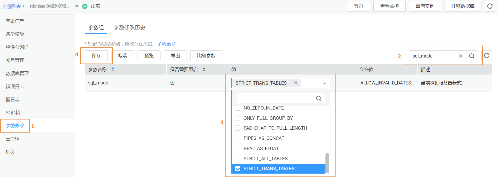
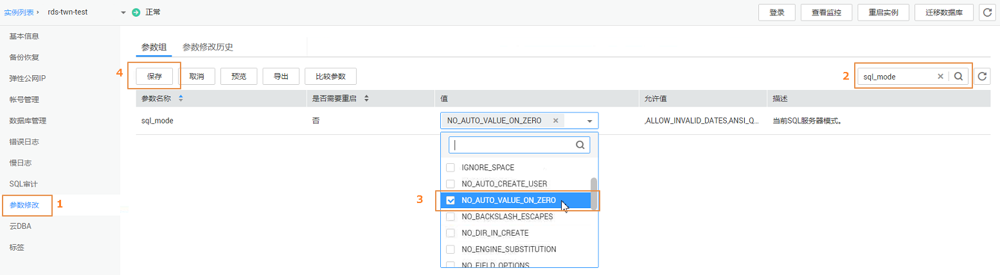

# 如何处理表中存在主键重复的数据

## 场景一

DDM实例的逻辑表中已存在主键数据类型边界值的记录，如果插入的数据超过主键数据类型的范围，表中会出现主键重复的数据。

## 处理方法

1.  登录华为云管理控制台。
2.  在RDS的“实例管理“页面，查找DDM实例对应的RDS实例，单击目标RDS实例名称，进入实例的“基本信息“页面。
3.  在基本信息页面的左侧导航栏中选择“参数修改“。
4.  在“参数组“页签搜索“sql\_mode“，单击“值“列中的下拉框，勾选“STRICT\_ALL\_TABLES“或“STRICT\_TRANS\_TABLES“方式，单击“保存“。

    > **说明：**   
    >“STRICT\_ALL\_TABLES“和“STRICT\_TRANS\_TABLES“方式属于严格模式。严格模式控制MySQL如何处理非法或丢失的输入值。  
    >-   非法：数据类型错误或超出范围。  
    >-   丢失：如果某列定义为非空列且没有DEFAULT值，当新插入的行不包含该列时，该行记录丢失。  
    >关于“sql\_mode“更多信息，请参考[Server SQL Modes](https://dev.mysql.com/doc/refman/5.7/en/sql-mode.html)。  

    **图 1**  修改实例参数  
    

5.  在“DDM实例管理“页面，重启DDM实例。

## 场景二

DDM实例的分片表（hash\\range\\mod）联合主键，如果拆分键数据中有插入0和1的话，一定会出现重复主键1。

## 处理方法

1.  登录华为云管理控制台。
2.  在RDS的“实例管理“页面，查找DDM实例对应的RDS实例，单击目标RDS实例名称，进入实例的“基本信息“页面。
3.  在基本信息页面的左侧导航栏中选择“参数修改“。
4.  在“参数组“页签搜索“sql\_mode“，单击“值“列中的下拉框，勾选“NO\_AUTO\_VALUE\_ON\_ZERO“方式，单击“保存“。

    **图 2**  修改实例参数  
    

5.  在“DDM实例管理“页面，重启DDM实例。

