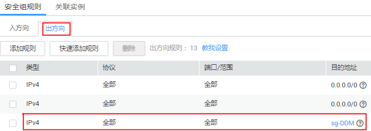
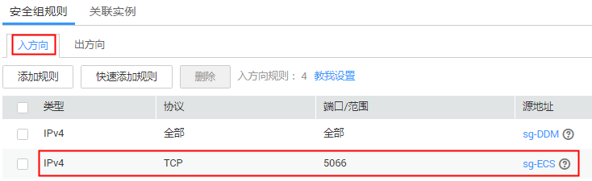
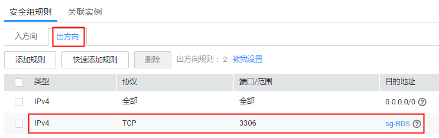
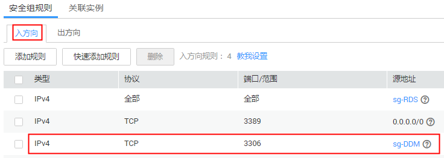

# 如何选择和配置安全组

DDM实例采用了VPC和安全组等网络安全保护措施，以下内容帮助您正确配置安全组。

## 通过VPC内网访问DDM实例

DDM实例的访问和使用，包括客户端所在ECS访问DDM实例，以及DDM实例访问其关联的RDS实例。

除了ECS、DDM实例、RDS实例必须处于相同VPC之外，还需要他们的安全组分别配置了正确的规则，允许网络访问。

1.  建议ECS、DDM、RDS配置相同的安全组。安全组创建后，默认包含同一安全组内网络访问不受限制的规则。
2.  如果配置了不同安全组，可参考如下配置方式：

    > **说明：**   
    >-   假设ECS、DDM、RDS分别配置了安全组：sg-ECS、sg-DDM、sg-RDS。  
    >-   假设DDM实例服务端口为5066，RDS实例服务端口为3306。  
    >-   以下规则，远端可使用安全组，也可以使用具体的IP地址。  

    ECS所在安全组需要增加[图1](#fig1336433121216)中的规则，以保证客户端能正常访问DDM实例：

    **图 1**  ECS安全组配置  
    

    DDM所在安全组需要增加[图2](#fig5451434121212)和[图3](#fig128025831211)中的规则，以保证能访问RDS，且被客户端访问。

    **图 2**  DDM安全组入方向配置  
    

    **图 3**  DDM安全组出方向配置  
    

    RDS所在安全组需要增加[图4](#fig1994261781310)中的规则，以保证能被DDM访问

    **图 4**  RDS安全组配置  
    

