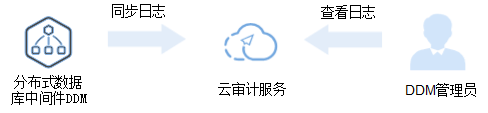

# 审计管理

## 开通云审计服务

如果您需要收集、记录或者查询DDM服务的操作日志，用于支撑安全分析、合规审计、资源跟踪和问题定位等常见应用场景时，那么需要先开通云审计服务。

云审计服务包含以下功能：

-   记录审计日志
-   审计日志查询
-   审计日志转储
-   事件文件加密
-   关键操作通知

## 查看审计日志

审计日志原理如[图1](#fig02702213817)所示。

**图 1**  审计日志原理  

## 查看关键操作列表

通过云审计服务，您可以记录与DDM相关的操作事件，便于日后的查询、审计和回溯。

## 关闭云审计服务

如果需要关闭云审计服务，具体步骤请参见《云审计服务用户指南》的“删除追踪器”章节内容。

