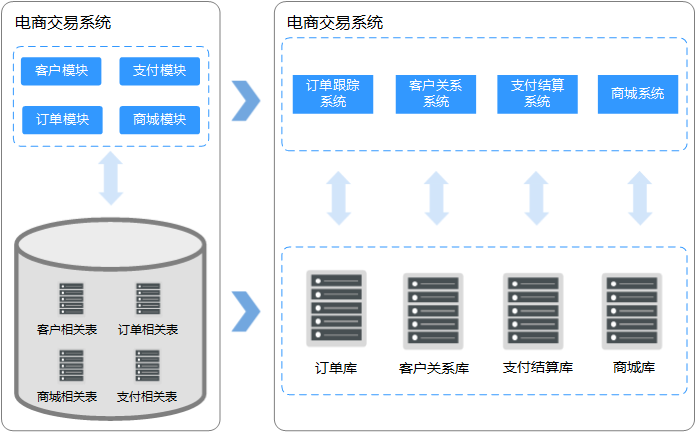
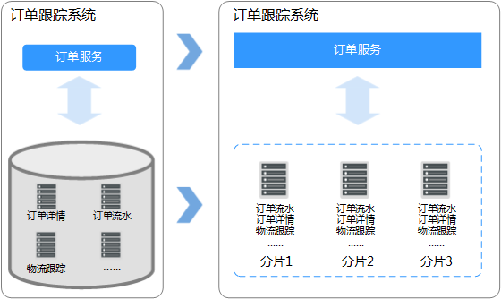
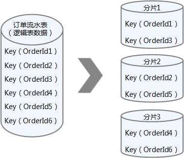

# 数据分片

数据分片是解决数据库存储容量限制的直接途径，数据分片包括垂直分片与水平分片两种方式。

-   **垂直分片**

    垂直分片又叫纵向分割，即以逻辑表为单位，把原有数据库切分成多个数据库。切分后不同的表存储在不同的数据库上。

    垂直分片与业务架构设计有密切的联系。比如从业务领域对系统进行架构优化，分成多个子业务系统，各个子业务系统耦合度较低。子业务系统间以接口方式进行数据通信和数据交换。

    **图 1**  垂直分片示意图  
    

    垂直拆分后业务清晰，拆分规则明确，系统之间容易整合与扩展。一般用于数据库上层架构设计。

-   **水平分片**

    水平分片又叫横向分割，即以逻辑表中的数据行记录为单位，把原有逻辑数据库切分成多个物理数据库分片，表数据记录分布存储在各个分片上。DDM的分库分表，即为水平分片。

    当业务架构无法继续细分，而数据库中单张表数据量太大，查询性能下降时，适用于水平方式的数据分片。通过水平分片，既解决单库容量问题，同时提高并发查询性能。

    **图 2**  水平分片示意图  
    

    DDM实现了自动水平分片，应用无需关心某个数据该存储在哪一块分片上。

    对逻辑表水平分片需要依据一定的分片规则，例如一个订单跟踪系统（见[图2](#fig1142416497394)），我们选取订单号\(OrderId\)作为拆分键，分别对“订单流水表”、“订单详情表”以及“物流跟踪表”进行水平拆分，拆分算法以Hash为例，对拆分键的值Hash后求模，分片计算规则如下：

    H\(Key\(OrderId\)\) = Hash\(Key\(OrderId\)\)%N

    其中，N表示一共有N个数据分片，H\(Key\(OrderId\)\)表示该订单经过订单号Hash并求模后存储的分片编号。

    **图 3**  分片后数据存储示意图  
    

