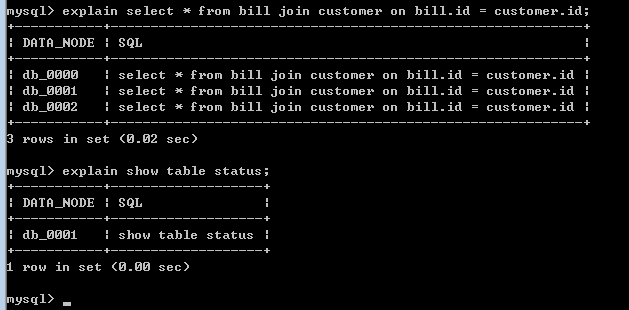

# 数据库管理语法

## 兼容的数据库管理语法

-   SHOW Syntax
-   SHOW COLUMNS Syntax
-   SHOW CREATE TABLE Syntax
-   SHOW TABLE STATUS Syntax
-   SHOW TABLES Syntax
-   SHOW DATABASES
-   SHOW INDEX FROM
-   SHOW VARIABLES Syntax

## 支持的数据库工具命令

-   DESC Syntax
-   USE Syntax
-   EXPLAIN Syntax

    与mysql内部的explain有所区别，DDM的explain显示的结果是当前语句路由到的节点描述，详情如[图1](#fig15587121801713)所示。

    **图 1**  DDM的explain显示结果  
    

## 不支持的数据库管理语法

**表 1**  数据库管理语句的限制

<table><thead align="left"><tr id="zh-cn_topic_0169506650_row1359552215619"><th class="cellrowborder" valign="top" width="18.91%" id="mcps1.2.3.1.1">
数据库管理语句

</th>
<th class="cellrowborder" valign="top" width="81.08999999999999%" id="mcps1.2.3.1.2">
限制条件

</th>
</tr>
</thead>
<tbody><tr id="zh-cn_topic_0169506650_row1059552214563"><td class="cellrowborder" valign="top" width="18.91%" headers="mcps1.2.3.1.1 ">
数据库管理语句

</td>
<td class="cellrowborder" valign="top" width="81.08999999999999%" headers="mcps1.2.3.1.2 "><ul id="zh-cn_topic_0169506650_u6486dcb468cb43ae91255d0c62dba963"><li class="msonormal">不支持SET Syntax修改全局变量。</li><li>不支持SHOW TRIGGERS语法。</li><li>不支持SHOW TABLE STATUS语法。</li></ul>

下列的SHOW指令会随机发到某个物理分片，每个物理分片如果在不同的RDS上，查得的变量或者表信息可能不同：

<ul id="zh-cn_topic_0169506650_zh-cn_topic_0077295701_ul7281275257"><li class="msonormal">SHOW TABLE STATUS</li><li>SHOW VARIABLES Syntax</li></ul>
</td>
</tr>
</tbody>
</table>

