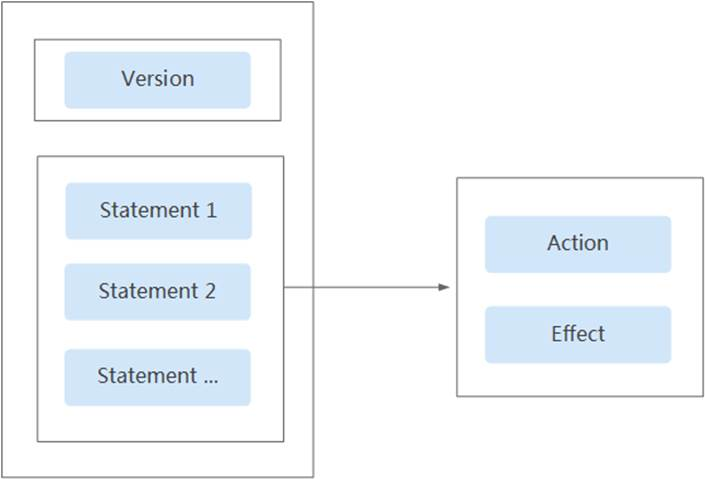
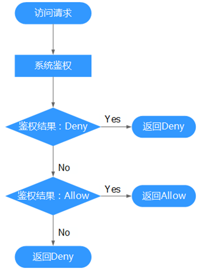

# 细粒度策略<a name="ddm_05_0002"></a>

细粒度策略是描述一组权限集的语言，它可以精确地描述被授权的资源集和操作集，通过策略，用户可以自由搭配需要授予的权限集，策略中可以包含多个云服务的多个操作权限，也可以只包含单个云服务的单个操作权限。通过给用户组授予策略，用户组中的用户就能获得策略中定义的权限，IAM通过策略定义的权限内容实现精细的权限管理。

IAM支持以下两种形式的策略：

-   系统策略：系统预置的常用权限集，主要针对不同云服务的只读权限或管理员权限，比如对DDM的只读权限、对DDM的管理员权限等；系统策略只能用于授权，不能编辑和修改。
-   自定义策略：由用户自己创建和管理的权限集，是对系统策略的扩展和补充。

策略定义后，您可以通过以下两种方式为用户组授权。关于设置策略的具体操作，请参考[创建用户并授权使用DDM](创建用户并授权使用DDM.md)。

-   在IAM侧为用户组设置策略时，该策略对所有企业项目生效。
-   在企业管理侧的企业项目管理与人员管理中设置策略时，仅对绑定的企业项目生效。

    **表 1**  DDM系统策略

    <a name="table12468846114614"></a>
    <table><thead align="left"><tr id="row15781164614464"><th class="cellrowborder" valign="top" width="21.94%" id="mcps1.2.4.1.1"><p id="p16781646164614"><a name="p16781646164614"></a><a name="p16781646164614"></a>策略名称</p>
    </th>
    <th class="cellrowborder" valign="top" width="60.3%" id="mcps1.2.4.1.2"><p id="p7781114604619"><a name="p7781114604619"></a><a name="p7781114604619"></a>描述</p>
    </th>
    <th class="cellrowborder" valign="top" width="17.76%" id="mcps1.2.4.1.3"><p id="p20781204610466"><a name="p20781204610466"></a><a name="p20781204610466"></a>策略类别</p>
    </th>
    </tr>
    </thead>
    <tbody><tr id="row0782144611465"><td class="cellrowborder" valign="top" width="21.94%" headers="mcps1.2.4.1.1 "><p id="p13782204614613"><a name="p13782204614613"></a><a name="p13782204614613"></a>DDM Admin</p>
    </td>
    <td class="cellrowborder" valign="top" width="60.3%" headers="mcps1.2.4.1.2 "><p id="p1496292619274"><a name="p1496292619274"></a><a name="p1496292619274"></a>具备DDM服务管理员权限，能执行DDM的所有操作。</p>
    </td>
    <td class="cellrowborder" valign="top" width="17.76%" headers="mcps1.2.4.1.3 "><p id="p1878254654613"><a name="p1878254654613"></a><a name="p1878254654613"></a>细粒度策略</p>
    </td>
    </tr>
    <tr id="row187821468469"><td class="cellrowborder" valign="top" width="21.94%" headers="mcps1.2.4.1.1 "><p id="p1878264664610"><a name="p1878264664610"></a><a name="p1878264664610"></a>DDM User</p>
    </td>
    <td class="cellrowborder" valign="top" width="60.3%" headers="mcps1.2.4.1.2 "><p id="p49621626152714"><a name="p49621626152714"></a><a name="p49621626152714"></a>具备DDM服务普通权限。</p>
    <p id="p20246117125313"><a name="p20246117125313"></a><a name="p20246117125313"></a>普通权限和管理员权限比较，普通权限不具备以下操作权限：</p>
    <a name="ul3339191595419"></a><a name="ul3339191595419"></a><ul id="ul3339191595419"><li>购买DDM实例</li><li>删除DDM实例</li><li>平滑扩容</li><li>扩容失败-回滚、扩容失败-清理</li></ul>
    </td>
    <td class="cellrowborder" valign="top" width="17.76%" headers="mcps1.2.4.1.3 "><p id="p178216460467"><a name="p178216460467"></a><a name="p178216460467"></a>细粒度策略</p>
    </td>
    </tr>
    <tr id="row177821846114612"><td class="cellrowborder" valign="top" width="21.94%" headers="mcps1.2.4.1.1 "><p id="p3785144664614"><a name="p3785144664614"></a><a name="p3785144664614"></a>DDM Viewer</p>
    </td>
    <td class="cellrowborder" valign="top" width="60.3%" headers="mcps1.2.4.1.2 "><p id="p596272622710"><a name="p596272622710"></a><a name="p596272622710"></a>具备DDM服务查看权限。</p>
    </td>
    <td class="cellrowborder" valign="top" width="17.76%" headers="mcps1.2.4.1.3 "><p id="p107851346144615"><a name="p107851346144615"></a><a name="p107851346144615"></a>细粒度策略</p>
    </td>
    </tr>
    </tbody>
    </table>

    **表 2**  常用操作与系统策略的关系

    <a name="table15201146114610"></a>
    <table><thead align="left"><tr id="row20789446104614"><th class="cellrowborder" valign="top" width="35.21%" id="mcps1.2.5.1.1"><p id="p678917468469"><a name="p678917468469"></a><a name="p678917468469"></a>操作</p>
    </th>
    <th class="cellrowborder" valign="top" width="21.61%" id="mcps1.2.5.1.2"><p id="p87893467461"><a name="p87893467461"></a><a name="p87893467461"></a>DDM Admin</p>
    </th>
    <th class="cellrowborder" valign="top" width="21.92%" id="mcps1.2.5.1.3"><p id="p97892469463"><a name="p97892469463"></a><a name="p97892469463"></a>DDM User</p>
    </th>
    <th class="cellrowborder" valign="top" width="21.26%" id="mcps1.2.5.1.4"><p id="p157891546194617"><a name="p157891546194617"></a><a name="p157891546194617"></a>DDM Viewer</p>
    </th>
    </tr>
    </thead>
    <tbody><tr id="row1578964611460"><td class="cellrowborder" valign="top" width="35.21%" headers="mcps1.2.5.1.1 "><p id="p189981053172818"><a name="p189981053172818"></a><a name="p189981053172818"></a>查询实例列表</p>
    </td>
    <td class="cellrowborder" valign="top" width="21.61%" headers="mcps1.2.5.1.2 "><p id="p7752258191417"><a name="p7752258191417"></a><a name="p7752258191417"></a>支持</p>
    </td>
    <td class="cellrowborder" valign="top" width="21.92%" headers="mcps1.2.5.1.3 "><p id="p1764195851415"><a name="p1764195851415"></a><a name="p1764195851415"></a>支持</p>
    </td>
    <td class="cellrowborder" valign="top" width="21.26%" headers="mcps1.2.5.1.4 "><p id="p277465816144"><a name="p277465816144"></a><a name="p277465816144"></a>支持</p>
    </td>
    </tr>
    <tr id="row16789124624612"><td class="cellrowborder" valign="top" width="35.21%" headers="mcps1.2.5.1.1 "><p id="p1899885392815"><a name="p1899885392815"></a><a name="p1899885392815"></a>查询实例详情</p>
    </td>
    <td class="cellrowborder" valign="top" width="21.61%" headers="mcps1.2.5.1.2 "><p id="p97861658101413"><a name="p97861658101413"></a><a name="p97861658101413"></a>支持</p>
    </td>
    <td class="cellrowborder" valign="top" width="21.92%" headers="mcps1.2.5.1.3 "><p id="p879712589147"><a name="p879712589147"></a><a name="p879712589147"></a>支持</p>
    </td>
    <td class="cellrowborder" valign="top" width="21.26%" headers="mcps1.2.5.1.4 "><p id="p11805115817141"><a name="p11805115817141"></a><a name="p11805115817141"></a>支持</p>
    </td>
    </tr>
    <tr id="row4843121310108"><td class="cellrowborder" valign="top" width="35.21%" headers="mcps1.2.5.1.1 "><p id="p209981353122816"><a name="p209981353122816"></a><a name="p209981353122816"></a>修改实例信息(修改描述，修改名称，修改维护时间窗口，修改安全组)</p>
    </td>
    <td class="cellrowborder" valign="top" width="21.61%" headers="mcps1.2.5.1.2 "><p id="p188149584144"><a name="p188149584144"></a><a name="p188149584144"></a>支持</p>
    </td>
    <td class="cellrowborder" valign="top" width="21.92%" headers="mcps1.2.5.1.3 "><p id="p182655812144"><a name="p182655812144"></a><a name="p182655812144"></a>支持</p>
    </td>
    <td class="cellrowborder" valign="top" width="21.26%" headers="mcps1.2.5.1.4 "><p id="p17836258121418"><a name="p17836258121418"></a><a name="p17836258121418"></a>不支持</p>
    </td>
    </tr>
    <tr id="row127904468462"><td class="cellrowborder" valign="top" width="35.21%" headers="mcps1.2.5.1.1 "><p id="p9998135319285"><a name="p9998135319285"></a><a name="p9998135319285"></a>重启实例</p>
    </td>
    <td class="cellrowborder" valign="top" width="21.61%" headers="mcps1.2.5.1.2 "><p id="p88478584147"><a name="p88478584147"></a><a name="p88478584147"></a>支持</p>
    </td>
    <td class="cellrowborder" valign="top" width="21.92%" headers="mcps1.2.5.1.3 "><p id="p8858258131419"><a name="p8858258131419"></a><a name="p8858258131419"></a>支持</p>
    </td>
    <td class="cellrowborder" valign="top" width="21.26%" headers="mcps1.2.5.1.4 "><p id="p1283720572111"><a name="p1283720572111"></a><a name="p1283720572111"></a>不支持</p>
    </td>
    </tr>
    <tr id="row10658151821013"><td class="cellrowborder" valign="top" width="35.21%" headers="mcps1.2.5.1.1 "><p id="p699805315285"><a name="p699805315285"></a><a name="p699805315285"></a>删除实例</p>
    </td>
    <td class="cellrowborder" valign="top" width="21.61%" headers="mcps1.2.5.1.2 "><p id="p8876105819148"><a name="p8876105819148"></a><a name="p8876105819148"></a>支持</p>
    </td>
    <td class="cellrowborder" valign="top" width="21.92%" headers="mcps1.2.5.1.3 "><p id="p11885125801411"><a name="p11885125801411"></a><a name="p11885125801411"></a>不支持</p>
    </td>
    <td class="cellrowborder" valign="top" width="21.26%" headers="mcps1.2.5.1.4 "><p id="p7869858219"><a name="p7869858219"></a><a name="p7869858219"></a>不支持</p>
    </td>
    </tr>
    <tr id="row5790174654617"><td class="cellrowborder" valign="top" width="35.21%" headers="mcps1.2.5.1.1 "><p id="p59981453102814"><a name="p59981453102814"></a><a name="p59981453102814"></a>参数列表查询</p>
    </td>
    <td class="cellrowborder" valign="top" width="21.61%" headers="mcps1.2.5.1.2 "><p id="p189051558201417"><a name="p189051558201417"></a><a name="p189051558201417"></a>支持</p>
    </td>
    <td class="cellrowborder" valign="top" width="21.92%" headers="mcps1.2.5.1.3 "><p id="p1991455818145"><a name="p1991455818145"></a><a name="p1991455818145"></a>支持</p>
    </td>
    <td class="cellrowborder" valign="top" width="21.26%" headers="mcps1.2.5.1.4 "><p id="p18923155818149"><a name="p18923155818149"></a><a name="p18923155818149"></a>支持</p>
    </td>
    </tr>
    <tr id="row87905469461"><td class="cellrowborder" valign="top" width="35.21%" headers="mcps1.2.5.1.1 "><p id="p169981853122818"><a name="p169981853122818"></a><a name="p169981853122818"></a>修改参数</p>
    </td>
    <td class="cellrowborder" valign="top" width="21.61%" headers="mcps1.2.5.1.2 "><p id="p12931115811418"><a name="p12931115811418"></a><a name="p12931115811418"></a>支持</p>
    </td>
    <td class="cellrowborder" valign="top" width="21.92%" headers="mcps1.2.5.1.3 "><p id="p1694214583149"><a name="p1694214583149"></a><a name="p1694214583149"></a>支持</p>
    </td>
    <td class="cellrowborder" valign="top" width="21.26%" headers="mcps1.2.5.1.4 "><p id="p99521158121411"><a name="p99521158121411"></a><a name="p99521158121411"></a>不支持</p>
    </td>
    </tr>
    <tr id="row0561193411016"><td class="cellrowborder" valign="top" width="35.21%" headers="mcps1.2.5.1.1 "><p id="p1699810532284"><a name="p1699810532284"></a><a name="p1699810532284"></a>读占比监控查询</p>
    </td>
    <td class="cellrowborder" valign="top" width="21.61%" headers="mcps1.2.5.1.2 "><p id="p115904161520"><a name="p115904161520"></a><a name="p115904161520"></a>支持</p>
    </td>
    <td class="cellrowborder" valign="top" width="21.92%" headers="mcps1.2.5.1.3 "><p id="p131959415159"><a name="p131959415159"></a><a name="p131959415159"></a>支持</p>
    </td>
    <td class="cellrowborder" valign="top" width="21.26%" headers="mcps1.2.5.1.4 "><p id="p20204104121514"><a name="p20204104121514"></a><a name="p20204104121514"></a>支持</p>
    </td>
    </tr>
    <tr id="row75588344104"><td class="cellrowborder" valign="top" width="35.21%" headers="mcps1.2.5.1.1 "><p id="p9998195382817"><a name="p9998195382817"></a><a name="p9998195382817"></a>慢SQL监控查询</p>
    </td>
    <td class="cellrowborder" valign="top" width="21.61%" headers="mcps1.2.5.1.2 "><p id="p321394101518"><a name="p321394101518"></a><a name="p321394101518"></a>支持</p>
    </td>
    <td class="cellrowborder" valign="top" width="21.92%" headers="mcps1.2.5.1.3 "><p id="p15222154131510"><a name="p15222154131510"></a><a name="p15222154131510"></a>支持</p>
    </td>
    <td class="cellrowborder" valign="top" width="21.26%" headers="mcps1.2.5.1.4 "><p id="p6232184181518"><a name="p6232184181518"></a><a name="p6232184181518"></a>支持</p>
    </td>
    </tr>
    <tr id="row12555934101012"><td class="cellrowborder" valign="top" width="35.21%" headers="mcps1.2.5.1.1 "><p id="p943494915402"><a name="p943494915402"></a><a name="p943494915402"></a>创建逻辑库</p>
    </td>
    <td class="cellrowborder" valign="top" width="21.61%" headers="mcps1.2.5.1.2 "><p id="p1823812451514"><a name="p1823812451514"></a><a name="p1823812451514"></a>支持</p>
    </td>
    <td class="cellrowborder" valign="top" width="21.92%" headers="mcps1.2.5.1.3 "><p id="p1824818401519"><a name="p1824818401519"></a><a name="p1824818401519"></a>支持</p>
    </td>
    <td class="cellrowborder" valign="top" width="21.26%" headers="mcps1.2.5.1.4 "><p id="p32567412156"><a name="p32567412156"></a><a name="p32567412156"></a>不支持</p>
    </td>
    </tr>
    <tr id="row185532344109"><td class="cellrowborder" valign="top" width="35.21%" headers="mcps1.2.5.1.1 "><p id="p843434916402"><a name="p843434916402"></a><a name="p843434916402"></a>查询逻辑库列表</p>
    </td>
    <td class="cellrowborder" valign="top" width="21.61%" headers="mcps1.2.5.1.2 "><p id="p152671241150"><a name="p152671241150"></a><a name="p152671241150"></a>支持</p>
    </td>
    <td class="cellrowborder" valign="top" width="21.92%" headers="mcps1.2.5.1.3 "><p id="p927574101511"><a name="p927574101511"></a><a name="p927574101511"></a>支持</p>
    </td>
    <td class="cellrowborder" valign="top" width="21.26%" headers="mcps1.2.5.1.4 "><p id="p5284184151511"><a name="p5284184151511"></a><a name="p5284184151511"></a>支持</p>
    </td>
    </tr>
    <tr id="row135501634151020"><td class="cellrowborder" valign="top" width="35.21%" headers="mcps1.2.5.1.1 "><p id="p18434164914020"><a name="p18434164914020"></a><a name="p18434164914020"></a>查询逻辑库详情</p>
    </td>
    <td class="cellrowborder" valign="top" width="21.61%" headers="mcps1.2.5.1.2 "><p id="p102930419155"><a name="p102930419155"></a><a name="p102930419155"></a>支持</p>
    </td>
    <td class="cellrowborder" valign="top" width="21.92%" headers="mcps1.2.5.1.3 "><p id="p4301847155"><a name="p4301847155"></a><a name="p4301847155"></a>支持</p>
    </td>
    <td class="cellrowborder" valign="top" width="21.26%" headers="mcps1.2.5.1.4 "><p id="p113117461514"><a name="p113117461514"></a><a name="p113117461514"></a>支持</p>
    </td>
    </tr>
    <tr id="row054863441019"><td class="cellrowborder" valign="top" width="35.21%" headers="mcps1.2.5.1.1 "><p id="p1434749104014"><a name="p1434749104014"></a><a name="p1434749104014"></a>平滑扩容</p>
    </td>
    <td class="cellrowborder" valign="top" width="21.61%" headers="mcps1.2.5.1.2 "><p id="p1732015413157"><a name="p1732015413157"></a><a name="p1732015413157"></a>支持</p>
    </td>
    <td class="cellrowborder" valign="top" width="21.92%" headers="mcps1.2.5.1.3 "><p id="p113301045159"><a name="p113301045159"></a><a name="p113301045159"></a>不支持</p>
    </td>
    <td class="cellrowborder" valign="top" width="21.26%" headers="mcps1.2.5.1.4 "><p id="p193371415156"><a name="p193371415156"></a><a name="p193371415156"></a>不支持</p>
    </td>
    </tr>
    <tr id="row175454348109"><td class="cellrowborder" valign="top" width="35.21%" headers="mcps1.2.5.1.1 "><p id="p443484944010"><a name="p443484944010"></a><a name="p443484944010"></a>扩容失败-回滚、</p>
    <p id="p7491107102710"><a name="p7491107102710"></a><a name="p7491107102710"></a>扩容失败-清理</p>
    </td>
    <td class="cellrowborder" valign="top" width="21.61%" headers="mcps1.2.5.1.2 "><p id="p634620421519"><a name="p634620421519"></a><a name="p634620421519"></a>支持</p>
    </td>
    <td class="cellrowborder" valign="top" width="21.92%" headers="mcps1.2.5.1.3 "><p id="p9353154101518"><a name="p9353154101518"></a><a name="p9353154101518"></a>不支持</p>
    </td>
    <td class="cellrowborder" valign="top" width="21.26%" headers="mcps1.2.5.1.4 "><p id="p83638411159"><a name="p83638411159"></a><a name="p83638411159"></a>不支持</p>
    </td>
    </tr>
    <tr id="row12542163413107"><td class="cellrowborder" valign="top" width="35.21%" headers="mcps1.2.5.1.1 "><p id="p1443494910405"><a name="p1443494910405"></a><a name="p1443494910405"></a>切换事物模型</p>
    </td>
    <td class="cellrowborder" valign="top" width="21.61%" headers="mcps1.2.5.1.2 "><p id="p13727491520"><a name="p13727491520"></a><a name="p13727491520"></a>支持</p>
    </td>
    <td class="cellrowborder" valign="top" width="21.92%" headers="mcps1.2.5.1.3 "><p id="p1338210441516"><a name="p1338210441516"></a><a name="p1338210441516"></a>支持</p>
    </td>
    <td class="cellrowborder" valign="top" width="21.26%" headers="mcps1.2.5.1.4 "><p id="p14476297216"><a name="p14476297216"></a><a name="p14476297216"></a>不支持</p>
    </td>
    </tr>
    <tr id="row20901839101010"><td class="cellrowborder" valign="top" width="35.21%" headers="mcps1.2.5.1.1 "><p id="p1643424914011"><a name="p1643424914011"></a><a name="p1643424914011"></a>删除逻辑库</p>
    </td>
    <td class="cellrowborder" valign="top" width="21.61%" headers="mcps1.2.5.1.2 "><p id="p64026411517"><a name="p64026411517"></a><a name="p64026411517"></a>支持</p>
    </td>
    <td class="cellrowborder" valign="top" width="21.92%" headers="mcps1.2.5.1.3 "><p id="p241210413159"><a name="p241210413159"></a><a name="p241210413159"></a>支持</p>
    </td>
    <td class="cellrowborder" valign="top" width="21.26%" headers="mcps1.2.5.1.4 "><p id="p6456729172119"><a name="p6456729172119"></a><a name="p6456729172119"></a>不支持</p>
    </td>
    </tr>
    <tr id="row17872399100"><td class="cellrowborder" valign="top" width="35.21%" headers="mcps1.2.5.1.1 "><p id="p88981726164117"><a name="p88981726164117"></a><a name="p88981726164117"></a>创建逻辑表</p>
    </td>
    <td class="cellrowborder" valign="top" width="21.61%" headers="mcps1.2.5.1.2 "><p id="p1542984101511"><a name="p1542984101511"></a><a name="p1542984101511"></a>支持</p>
    </td>
    <td class="cellrowborder" valign="top" width="21.92%" headers="mcps1.2.5.1.3 "><p id="p2043944171519"><a name="p2043944171519"></a><a name="p2043944171519"></a>支持</p>
    </td>
    <td class="cellrowborder" valign="top" width="21.26%" headers="mcps1.2.5.1.4 "><p id="p9465132913213"><a name="p9465132913213"></a><a name="p9465132913213"></a>不支持</p>
    </td>
    </tr>
    <tr id="row1584153915100"><td class="cellrowborder" valign="top" width="35.21%" headers="mcps1.2.5.1.1 "><p id="p38984267419"><a name="p38984267419"></a><a name="p38984267419"></a>查询逻辑表列表</p>
    </td>
    <td class="cellrowborder" valign="top" width="21.61%" headers="mcps1.2.5.1.2 "><p id="p2045515451516"><a name="p2045515451516"></a><a name="p2045515451516"></a>支持</p>
    </td>
    <td class="cellrowborder" valign="top" width="21.92%" headers="mcps1.2.5.1.3 "><p id="p14461442152"><a name="p14461442152"></a><a name="p14461442152"></a>支持</p>
    </td>
    <td class="cellrowborder" valign="top" width="21.26%" headers="mcps1.2.5.1.4 "><p id="p64708461512"><a name="p64708461512"></a><a name="p64708461512"></a>支持</p>
    </td>
    </tr>
    <tr id="row38110395103"><td class="cellrowborder" valign="top" width="35.21%" headers="mcps1.2.5.1.1 "><p id="p38981726134116"><a name="p38981726134116"></a><a name="p38981726134116"></a>修改逻辑表（拆分规则）</p>
    </td>
    <td class="cellrowborder" valign="top" width="21.61%" headers="mcps1.2.5.1.2 "><p id="p174788410159"><a name="p174788410159"></a><a name="p174788410159"></a>支持</p>
    </td>
    <td class="cellrowborder" valign="top" width="21.92%" headers="mcps1.2.5.1.3 "><p id="p1448516411516"><a name="p1448516411516"></a><a name="p1448516411516"></a>支持</p>
    </td>
    <td class="cellrowborder" valign="top" width="21.26%" headers="mcps1.2.5.1.4 "><p id="p1849454121515"><a name="p1849454121515"></a><a name="p1849454121515"></a>不支持</p>
    </td>
    </tr>
    <tr id="row15791439131016"><td class="cellrowborder" valign="top" width="35.21%" headers="mcps1.2.5.1.1 "><p id="p14898126144111"><a name="p14898126144111"></a><a name="p14898126144111"></a>删除逻辑表</p>
    </td>
    <td class="cellrowborder" valign="top" width="21.61%" headers="mcps1.2.5.1.2 "><p id="p16504124151516"><a name="p16504124151516"></a><a name="p16504124151516"></a>支持</p>
    </td>
    <td class="cellrowborder" valign="top" width="21.92%" headers="mcps1.2.5.1.3 "><p id="p1751414418151"><a name="p1751414418151"></a><a name="p1751414418151"></a>支持</p>
    </td>
    <td class="cellrowborder" valign="top" width="21.26%" headers="mcps1.2.5.1.4 "><p id="p125224491511"><a name="p125224491511"></a><a name="p125224491511"></a>不支持</p>
    </td>
    </tr>
    <tr id="row076939191012"><td class="cellrowborder" valign="top" width="35.21%" headers="mcps1.2.5.1.1 "><p id="p152018117428"><a name="p152018117428"></a><a name="p152018117428"></a>查询账号列表</p>
    </td>
    <td class="cellrowborder" valign="top" width="21.61%" headers="mcps1.2.5.1.2 "><p id="p155315451519"><a name="p155315451519"></a><a name="p155315451519"></a>支持</p>
    </td>
    <td class="cellrowborder" valign="top" width="21.92%" headers="mcps1.2.5.1.3 "><p id="p45398481513"><a name="p45398481513"></a><a name="p45398481513"></a>支持</p>
    </td>
    <td class="cellrowborder" valign="top" width="21.26%" headers="mcps1.2.5.1.4 "><p id="p115482412153"><a name="p115482412153"></a><a name="p115482412153"></a>支持</p>
    </td>
    </tr>
    <tr id="row1374183919109"><td class="cellrowborder" valign="top" width="35.21%" headers="mcps1.2.5.1.1 "><p id="p1520120174218"><a name="p1520120174218"></a><a name="p1520120174218"></a>创建账号</p>
    </td>
    <td class="cellrowborder" valign="top" width="21.61%" headers="mcps1.2.5.1.2 "><p id="p1355684181513"><a name="p1355684181513"></a><a name="p1355684181513"></a>支持</p>
    </td>
    <td class="cellrowborder" valign="top" width="21.92%" headers="mcps1.2.5.1.3 "><p id="p456412441516"><a name="p456412441516"></a><a name="p456412441516"></a>支持</p>
    </td>
    <td class="cellrowborder" valign="top" width="21.26%" headers="mcps1.2.5.1.4 "><p id="p65727441519"><a name="p65727441519"></a><a name="p65727441519"></a>不支持</p>
    </td>
    </tr>
    <tr id="row871103917107"><td class="cellrowborder" valign="top" width="35.21%" headers="mcps1.2.5.1.1 "><p id="p11201161154214"><a name="p11201161154214"></a><a name="p11201161154214"></a>修改账号</p>
    </td>
    <td class="cellrowborder" valign="top" width="21.61%" headers="mcps1.2.5.1.2 "><p id="p155825451511"><a name="p155825451511"></a><a name="p155825451511"></a>支持</p>
    </td>
    <td class="cellrowborder" valign="top" width="21.92%" headers="mcps1.2.5.1.3 "><p id="p559244151511"><a name="p559244151511"></a><a name="p559244151511"></a>支持</p>
    </td>
    <td class="cellrowborder" valign="top" width="21.26%" headers="mcps1.2.5.1.4 "><p id="p69732421218"><a name="p69732421218"></a><a name="p69732421218"></a>不支持</p>
    </td>
    </tr>
    <tr id="row46091843181017"><td class="cellrowborder" valign="top" width="35.21%" headers="mcps1.2.5.1.1 "><p id="p172016116428"><a name="p172016116428"></a><a name="p172016116428"></a>重置密码</p>
    </td>
    <td class="cellrowborder" valign="top" width="21.61%" headers="mcps1.2.5.1.2 "><p id="p6611548155"><a name="p6611548155"></a><a name="p6611548155"></a>支持</p>
    </td>
    <td class="cellrowborder" valign="top" width="21.92%" headers="mcps1.2.5.1.3 "><p id="p362217417157"><a name="p362217417157"></a><a name="p362217417157"></a>支持</p>
    </td>
    <td class="cellrowborder" valign="top" width="21.26%" headers="mcps1.2.5.1.4 "><p id="p13981842132113"><a name="p13981842132113"></a><a name="p13981842132113"></a>不支持</p>
    </td>
    </tr>
    <tr id="row1660654316108"><td class="cellrowborder" valign="top" width="35.21%" headers="mcps1.2.5.1.1 "><p id="p1420121124214"><a name="p1420121124214"></a><a name="p1420121124214"></a>锁定、解锁账号</p>
    </td>
    <td class="cellrowborder" valign="top" width="21.61%" headers="mcps1.2.5.1.2 "><p id="p1464219441517"><a name="p1464219441517"></a><a name="p1464219441517"></a>支持</p>
    </td>
    <td class="cellrowborder" valign="top" width="21.92%" headers="mcps1.2.5.1.3 "><p id="p96501045153"><a name="p96501045153"></a><a name="p96501045153"></a>支持</p>
    </td>
    <td class="cellrowborder" valign="top" width="21.26%" headers="mcps1.2.5.1.4 "><p id="p5266164917211"><a name="p5266164917211"></a><a name="p5266164917211"></a>不支持</p>
    </td>
    </tr>
    <tr id="row1360211439101"><td class="cellrowborder" valign="top" width="35.21%" headers="mcps1.2.5.1.1 "><p id="p420117110424"><a name="p420117110424"></a><a name="p420117110424"></a>删除账号</p>
    </td>
    <td class="cellrowborder" valign="top" width="21.61%" headers="mcps1.2.5.1.2 "><p id="p176660418156"><a name="p176660418156"></a><a name="p176660418156"></a>支持</p>
    </td>
    <td class="cellrowborder" valign="top" width="21.92%" headers="mcps1.2.5.1.3 "><p id="p1267674141516"><a name="p1267674141516"></a><a name="p1267674141516"></a>支持</p>
    </td>
    <td class="cellrowborder" valign="top" width="21.26%" headers="mcps1.2.5.1.4 "><p id="p12277194918213"><a name="p12277194918213"></a><a name="p12277194918213"></a>不支持</p>
    </td>
    </tr>
    <tr id="row259914391015"><td class="cellrowborder" valign="top" width="35.21%" headers="mcps1.2.5.1.1 "><p id="p12624413425"><a name="p12624413425"></a><a name="p12624413425"></a>导入RDS</p>
    </td>
    <td class="cellrowborder" valign="top" width="21.61%" headers="mcps1.2.5.1.2 "><p id="p206951041159"><a name="p206951041159"></a><a name="p206951041159"></a>支持</p>
    </td>
    <td class="cellrowborder" valign="top" width="21.92%" headers="mcps1.2.5.1.3 "><p id="p1370419461512"><a name="p1370419461512"></a><a name="p1370419461512"></a>支持</p>
    </td>
    <td class="cellrowborder" valign="top" width="21.26%" headers="mcps1.2.5.1.4 "><p id="p107128410156"><a name="p107128410156"></a><a name="p107128410156"></a>不支持</p>
    </td>
    </tr>
    <tr id="row11596643161018"><td class="cellrowborder" valign="top" width="35.21%" headers="mcps1.2.5.1.1 "><p id="p7622414427"><a name="p7622414427"></a><a name="p7622414427"></a>同步RDS</p>
    </td>
    <td class="cellrowborder" valign="top" width="21.61%" headers="mcps1.2.5.1.2 "><p id="p58441915159"><a name="p58441915159"></a><a name="p58441915159"></a>支持</p>
    </td>
    <td class="cellrowborder" valign="top" width="21.92%" headers="mcps1.2.5.1.3 "><p id="p1851994153"><a name="p1851994153"></a><a name="p1851994153"></a>支持</p>
    </td>
    <td class="cellrowborder" valign="top" width="21.26%" headers="mcps1.2.5.1.4 "><p id="p88598914150"><a name="p88598914150"></a><a name="p88598914150"></a>不支持</p>
    </td>
    </tr>
    <tr id="row75935433109"><td class="cellrowborder" valign="top" width="35.21%" headers="mcps1.2.5.1.1 "><p id="p662641124218"><a name="p662641124218"></a><a name="p662641124218"></a>查询RDS列表</p>
    </td>
    <td class="cellrowborder" valign="top" width="21.61%" headers="mcps1.2.5.1.2 "><p id="p58662099157"><a name="p58662099157"></a><a name="p58662099157"></a>支持</p>
    </td>
    <td class="cellrowborder" valign="top" width="21.92%" headers="mcps1.2.5.1.3 "><p id="p1487319916157"><a name="p1487319916157"></a><a name="p1487319916157"></a>支持</p>
    </td>
    <td class="cellrowborder" valign="top" width="21.26%" headers="mcps1.2.5.1.4 "><p id="p0882199121511"><a name="p0882199121511"></a><a name="p0882199121511"></a>支持</p>
    </td>
    </tr>
    <tr id="row115901343141011"><td class="cellrowborder" valign="top" width="35.21%" headers="mcps1.2.5.1.1 "><p id="p1963144118426"><a name="p1963144118426"></a><a name="p1963144118426"></a>查询RDS详情</p>
    </td>
    <td class="cellrowborder" valign="top" width="21.61%" headers="mcps1.2.5.1.2 "><p id="p208918981517"><a name="p208918981517"></a><a name="p208918981517"></a>支持</p>
    </td>
    <td class="cellrowborder" valign="top" width="21.92%" headers="mcps1.2.5.1.3 "><p id="p290010913153"><a name="p290010913153"></a><a name="p290010913153"></a>支持</p>
    </td>
    <td class="cellrowborder" valign="top" width="21.26%" headers="mcps1.2.5.1.4 "><p id="p1690810971513"><a name="p1690810971513"></a><a name="p1690810971513"></a>支持</p>
    </td>
    </tr>
    <tr id="row2058616438100"><td class="cellrowborder" valign="top" width="35.21%" headers="mcps1.2.5.1.1 "><p id="p5631241114219"><a name="p5631241114219"></a><a name="p5631241114219"></a>修改管理员账号</p>
    </td>
    <td class="cellrowborder" valign="top" width="21.61%" headers="mcps1.2.5.1.2 "><p id="p0916793153"><a name="p0916793153"></a><a name="p0916793153"></a>支持</p>
    </td>
    <td class="cellrowborder" valign="top" width="21.92%" headers="mcps1.2.5.1.3 "><p id="p119251696155"><a name="p119251696155"></a><a name="p119251696155"></a>支持</p>
    </td>
    <td class="cellrowborder" valign="top" width="21.26%" headers="mcps1.2.5.1.4 "><p id="p134781759192112"><a name="p134781759192112"></a><a name="p134781759192112"></a>不支持</p>
    </td>
    </tr>
    <tr id="row131661948141019"><td class="cellrowborder" valign="top" width="35.21%" headers="mcps1.2.5.1.1 "><p id="p12631641174212"><a name="p12631641174212"></a><a name="p12631641174212"></a>重置RDS内置账号</p>
    </td>
    <td class="cellrowborder" valign="top" width="21.61%" headers="mcps1.2.5.1.2 "><p id="p199382915159"><a name="p199382915159"></a><a name="p199382915159"></a>支持</p>
    </td>
    <td class="cellrowborder" valign="top" width="21.92%" headers="mcps1.2.5.1.3 "><p id="p194511911151"><a name="p194511911151"></a><a name="p194511911151"></a>支持</p>
    </td>
    <td class="cellrowborder" valign="top" width="21.26%" headers="mcps1.2.5.1.4 "><p id="p648812594211"><a name="p648812594211"></a><a name="p648812594211"></a>不支持</p>
    </td>
    </tr>
    <tr id="row31661348131010"><td class="cellrowborder" valign="top" width="35.21%" headers="mcps1.2.5.1.1 "><p id="p1563114184219"><a name="p1563114184219"></a><a name="p1563114184219"></a>RDS连通性检查</p>
    </td>
    <td class="cellrowborder" valign="top" width="21.61%" headers="mcps1.2.5.1.2 "><p id="p189627912157"><a name="p189627912157"></a><a name="p189627912157"></a>支持</p>
    </td>
    <td class="cellrowborder" valign="top" width="21.92%" headers="mcps1.2.5.1.3 "><p id="p1797009121517"><a name="p1797009121517"></a><a name="p1797009121517"></a>支持</p>
    </td>
    <td class="cellrowborder" valign="top" width="21.26%" headers="mcps1.2.5.1.4 "><p id="p139814921519"><a name="p139814921519"></a><a name="p139814921519"></a>支持</p>
    </td>
    </tr>
    <tr id="row1166548191017"><td class="cellrowborder" valign="top" width="35.21%" headers="mcps1.2.5.1.1 "><p id="p15631841144214"><a name="p15631841144214"></a><a name="p15631841144214"></a>修改RDS读策略</p>
    </td>
    <td class="cellrowborder" valign="top" width="21.61%" headers="mcps1.2.5.1.2 "><p id="p119888971514"><a name="p119888971514"></a><a name="p119888971514"></a>支持</p>
    </td>
    <td class="cellrowborder" valign="top" width="21.92%" headers="mcps1.2.5.1.3 "><p id="p16996296155"><a name="p16996296155"></a><a name="p16996296155"></a>支持</p>
    </td>
    <td class="cellrowborder" valign="top" width="21.26%" headers="mcps1.2.5.1.4 "><p id="p189551659221"><a name="p189551659221"></a><a name="p189551659221"></a>不支持</p>
    </td>
    </tr>
    <tr id="row201660480104"><td class="cellrowborder" valign="top" width="35.21%" headers="mcps1.2.5.1.1 "><p id="p363194113422"><a name="p363194113422"></a><a name="p363194113422"></a>移除RDS</p>
    </td>
    <td class="cellrowborder" valign="top" width="21.61%" headers="mcps1.2.5.1.2 "><p id="p1210310181519"><a name="p1210310181519"></a><a name="p1210310181519"></a>支持</p>
    </td>
    <td class="cellrowborder" valign="top" width="21.92%" headers="mcps1.2.5.1.3 "><p id="p141961011516"><a name="p141961011516"></a><a name="p141961011516"></a>支持</p>
    </td>
    <td class="cellrowborder" valign="top" width="21.26%" headers="mcps1.2.5.1.4 "><p id="p99624582215"><a name="p99624582215"></a><a name="p99624582215"></a>不支持</p>
    </td>
    </tr>
    <tr id="row19166164811019"><td class="cellrowborder" valign="top" width="35.21%" headers="mcps1.2.5.1.1 "><p id="p12586203794214"><a name="p12586203794214"></a><a name="p12586203794214"></a>查看产品信息列表</p>
    </td>
    <td class="cellrowborder" valign="top" width="21.61%" headers="mcps1.2.5.1.2 "><p id="p0361110131517"><a name="p0361110131517"></a><a name="p0361110131517"></a>支持</p>
    </td>
    <td class="cellrowborder" valign="top" width="21.92%" headers="mcps1.2.5.1.3 "><p id="p154441013158"><a name="p154441013158"></a><a name="p154441013158"></a>支持</p>
    </td>
    <td class="cellrowborder" valign="top" width="21.26%" headers="mcps1.2.5.1.4 "><p id="p1353131051517"><a name="p1353131051517"></a><a name="p1353131051517"></a>支持</p>
    </td>
    </tr>
    <tr id="row1516634851020"><td class="cellrowborder" valign="top" width="35.21%" headers="mcps1.2.5.1.1 "><p id="p1526993718454"><a name="p1526993718454"></a><a name="p1526993718454"></a>查看任务列表</p>
    </td>
    <td class="cellrowborder" valign="top" width="21.61%" headers="mcps1.2.5.1.2 "><p id="p15631410161517"><a name="p15631410161517"></a><a name="p15631410161517"></a>支持</p>
    </td>
    <td class="cellrowborder" valign="top" width="21.92%" headers="mcps1.2.5.1.3 "><p id="p1371610141514"><a name="p1371610141514"></a><a name="p1371610141514"></a>支持</p>
    </td>
    <td class="cellrowborder" valign="top" width="21.26%" headers="mcps1.2.5.1.4 "><p id="p128081012153"><a name="p128081012153"></a><a name="p128081012153"></a>支持</p>
    </td>
    </tr>
    <tr id="row41666484100"><td class="cellrowborder" valign="top" width="35.21%" headers="mcps1.2.5.1.1 "><p id="p20269337194513"><a name="p20269337194513"></a><a name="p20269337194513"></a>查看任务详情</p>
    </td>
    <td class="cellrowborder" valign="top" width="21.61%" headers="mcps1.2.5.1.2 "><p id="p58711014150"><a name="p58711014150"></a><a name="p58711014150"></a>支持</p>
    </td>
    <td class="cellrowborder" valign="top" width="21.92%" headers="mcps1.2.5.1.3 "><p id="p3963109157"><a name="p3963109157"></a><a name="p3963109157"></a>支持</p>
    </td>
    <td class="cellrowborder" valign="top" width="21.26%" headers="mcps1.2.5.1.4 "><p id="p110351001510"><a name="p110351001510"></a><a name="p110351001510"></a>支持</p>
    </td>
    </tr>
    </tbody>
    </table>

    **表 3**  常用操作与对应授权项

    <a name="table1838338112817"></a>
    <table><thead align="left"><tr id="row1238328192818"><th class="cellrowborder" valign="top" width="15.831583158315832%" id="mcps1.2.4.1.1"><p id="p1238318112816"><a name="p1238318112816"></a><a name="p1238318112816"></a>操作分类</p>
    </th>
    <th class="cellrowborder" valign="top" width="17.04170417041704%" id="mcps1.2.4.1.2"><p id="p538314819289"><a name="p538314819289"></a><a name="p538314819289"></a>详细操作</p>
    </th>
    <th class="cellrowborder" valign="top" width="67.12671267126713%" id="mcps1.2.4.1.3"><p id="p1038310892812"><a name="p1038310892812"></a><a name="p1038310892812"></a>对应的操作权限</p>
    </th>
    </tr>
    </thead>
    <tbody><tr id="row9153162721915"><td class="cellrowborder" rowspan="12" valign="top" width="15.831583158315832%" headers="mcps1.2.4.1.1 "><p id="p1596112717302"><a name="p1596112717302"></a><a name="p1596112717302"></a>DDM日常操作</p>
    </td>
    <td class="cellrowborder" valign="top" width="17.04170417041704%" headers="mcps1.2.4.1.2 "><p id="p1617203316196"><a name="p1617203316196"></a><a name="p1617203316196"></a>购买实例（按需）</p>
    <p id="p20397184520290"><a name="p20397184520290"></a><a name="p20397184520290"></a>购买实例（包周期）</p>
    </td>
    <td class="cellrowborder" valign="top" width="67.12671267126713%" headers="mcps1.2.4.1.3 "><p id="p7114153914199"><a name="p7114153914199"></a><a name="p7114153914199"></a>ddm:instance:create</p>
    <p id="p15277235142916"><a name="p15277235142916"></a><a name="p15277235142916"></a>购买实例操作依赖以下权限，即要配置购买实例权限，必须配置以下依赖的权限，否则购买失败。</p>
    <a name="ul92792354295"></a><a name="ul92792354295"></a><ul id="ul92792354295"><li>ecs:*:get*</li><li>ecs:*:list*</li><li>ecs:cloudServerNics:update</li><li>ecs:serverInterfaces:use</li><li>全局/区域级指定vpc:port:*</li><li>BSS Finance、BSS Operator系统策略<p id="p1022734273020"><a name="p1022734273020"></a><a name="p1022734273020"></a>只有购买实例（包周期）操作才依赖这个权限，购买实例（按需）不需要。</p>
    </li></ul>
    </td>
    </tr>
    <tr id="row954711506217"><td class="cellrowborder" valign="top" headers="mcps1.2.4.1.1 "><p id="p05491350112113"><a name="p05491350112113"></a><a name="p05491350112113"></a>续费</p>
    </td>
    <td class="cellrowborder" valign="top" headers="mcps1.2.4.1.2 "><p id="p15549450152110"><a name="p15549450152110"></a><a name="p15549450152110"></a>需要配置BSS Finance、BSS Operator系统策略。设置方法如下：</p>
    <a name="ol17392125815"></a><a name="ol17392125815"></a><ol id="ol17392125815"><li>登录“统一身份认证页面”。</li><li>在左侧导航窗格中，单击“用户组”。</li><li><span>在</span><span>“用户组”</span><span>列表中，</span><span>单击 </span><span>“权限配置”</span><span>，修改用户组的权限。</span></li><li><span>单击需要修改权限的项目右侧的</span><span>“设置策略”</span>。</li><li>在“可选策略”列表中选择需要新增的BSS Finance、BSS Operator系统策略。</li></ol>
    </td>
    </tr>
    <tr id="row1154965002113"><td class="cellrowborder" valign="top" headers="mcps1.2.4.1.1 "><p id="p12549145019213"><a name="p12549145019213"></a><a name="p12549145019213"></a>转包周期</p>
    </td>
    <td class="cellrowborder" valign="top" headers="mcps1.2.4.1.2 "><p id="p46513391222"><a name="p46513391222"></a><a name="p46513391222"></a>需要配置BSS Finance、BSS Operator系统策略。设置方法同续费操作中。</p>
    </td>
    </tr>
    <tr id="row12383088286"><td class="cellrowborder" valign="top" headers="mcps1.2.4.1.1 "><p id="p817155713816"><a name="p817155713816"></a><a name="p817155713816"></a>查询实例列表</p>
    </td>
    <td class="cellrowborder" valign="top" headers="mcps1.2.4.1.2 "><p id="p1263142114298"><a name="p1263142114298"></a><a name="p1263142114298"></a>ddm:instance:list</p>
    </td>
    </tr>
    <tr id="row123835815289"><td class="cellrowborder" valign="top" headers="mcps1.2.4.1.1 "><p id="p61885723818"><a name="p61885723818"></a><a name="p61885723818"></a>查询实例详情</p>
    </td>
    <td class="cellrowborder" valign="top" headers="mcps1.2.4.1.2 "><p id="p1326311212298"><a name="p1326311212298"></a><a name="p1326311212298"></a>ddm:instance:get</p>
    <p id="p1841723011513"><a name="p1841723011513"></a><a name="p1841723011513"></a>查询实例详情操作依赖以下权限，即要配置查询实例详情权限，必须配置以下依赖的权限，否则查询信息不全。</p>
    <a name="ul241873020155"></a><a name="ul241873020155"></a><ul id="ul241873020155"><li>vpc:*:get*</li><li>vpc:*:list*</li></ul>
    </td>
    </tr>
    <tr id="row17383286288"><td class="cellrowborder" valign="top" headers="mcps1.2.4.1.1 "><p id="p8181579386"><a name="p8181579386"></a><a name="p8181579386"></a>修改实例信息(修改描述，修改名称，修改维护时间窗口，修改安全组)</p>
    </td>
    <td class="cellrowborder" valign="top" headers="mcps1.2.4.1.2 "><p id="p132632214297"><a name="p132632214297"></a><a name="p132632214297"></a>ddm:instance:modify</p>
    <div class="p" id="p1466122319192"><a name="p1466122319192"></a><a name="p1466122319192"></a>修改安全组操作依赖以下权限，即要修改安全组权限，必须配置以下依赖的权限，否则修改失败。<a name="ul15657532154612"></a><a name="ul15657532154612"></a><ul id="ul15657532154612"><li>vpc:*:get*</li><li>vpc:*:list*</li><li>vpc:ports:update</li></ul>
    </div>
    </td>
    </tr>
    <tr id="row113831887285"><td class="cellrowborder" valign="top" headers="mcps1.2.4.1.1 "><p id="p620357103813"><a name="p620357103813"></a><a name="p620357103813"></a>重启实例</p>
    </td>
    <td class="cellrowborder" valign="top" headers="mcps1.2.4.1.2 "><p id="p926382113294"><a name="p926382113294"></a><a name="p926382113294"></a>ddm:instance:reboot</p>
    </td>
    </tr>
    <tr id="row8384148172810"><td class="cellrowborder" valign="top" headers="mcps1.2.4.1.1 "><p id="p92195733819"><a name="p92195733819"></a><a name="p92195733819"></a>删除实例</p>
    </td>
    <td class="cellrowborder" valign="top" headers="mcps1.2.4.1.2 "><p id="p122631217294"><a name="p122631217294"></a><a name="p122631217294"></a>ddm:instance:delete</p>
    </td>
    </tr>
    <tr id="row03844816289"><td class="cellrowborder" valign="top" headers="mcps1.2.4.1.1 "><p id="p82195714382"><a name="p82195714382"></a><a name="p82195714382"></a>参数列表查询</p>
    </td>
    <td class="cellrowborder" valign="top" headers="mcps1.2.4.1.2 "><p id="p1026319213292"><a name="p1026319213292"></a><a name="p1026319213292"></a>ddm:instance:listParameter</p>
    </td>
    </tr>
    <tr id="row193841832819"><td class="cellrowborder" valign="top" headers="mcps1.2.4.1.1 "><p id="p52195733818"><a name="p52195733818"></a><a name="p52195733818"></a>修改参数</p>
    </td>
    <td class="cellrowborder" valign="top" headers="mcps1.2.4.1.2 "><p id="p14263152112912"><a name="p14263152112912"></a><a name="p14263152112912"></a>ddm:instance:modifyParameter</p>
    </td>
    </tr>
    <tr id="row33841083288"><td class="cellrowborder" valign="top" headers="mcps1.2.4.1.1 "><p id="p42145783817"><a name="p42145783817"></a><a name="p42145783817"></a>读占比监控查询</p>
    </td>
    <td class="cellrowborder" valign="top" headers="mcps1.2.4.1.2 "><p id="p1926382118293"><a name="p1926382118293"></a><a name="p1926382118293"></a>ddm:instance:listRwInfo</p>
    </td>
    </tr>
    <tr id="row1038412812814"><td class="cellrowborder" valign="top" headers="mcps1.2.4.1.1 "><p id="p142113572389"><a name="p142113572389"></a><a name="p142113572389"></a>慢&nbsp;SQL监控查询</p>
    </td>
    <td class="cellrowborder" valign="top" headers="mcps1.2.4.1.2 "><p id="p726417216296"><a name="p726417216296"></a><a name="p726417216296"></a>ddm:instance:listSlowSqlInfo</p>
    </td>
    </tr>
    <tr id="row1938414818285"><td class="cellrowborder" rowspan="6" valign="top" width="15.831583158315832%" headers="mcps1.2.4.1.1 "><p id="p1289535404018"><a name="p1289535404018"></a><a name="p1289535404018"></a>DDM-逻辑库相关操作</p>
    </td>
    <td class="cellrowborder" valign="top" width="17.04170417041704%" headers="mcps1.2.4.1.2 "><p id="p202175753817"><a name="p202175753817"></a><a name="p202175753817"></a>创建逻辑库</p>
    </td>
    <td class="cellrowborder" valign="top" width="67.12671267126713%" headers="mcps1.2.4.1.3 "><p id="p1142231134118"><a name="p1142231134118"></a><a name="p1142231134118"></a>ddm:database:create</p>
    </td>
    </tr>
    <tr id="row123844810285"><td class="cellrowborder" valign="top" headers="mcps1.2.4.1.1 "><p id="p1921657183810"><a name="p1921657183810"></a><a name="p1921657183810"></a>查询逻辑库列表</p>
    </td>
    <td class="cellrowborder" valign="top" headers="mcps1.2.4.1.2 "><p id="p104222174119"><a name="p104222174119"></a><a name="p104222174119"></a>ddm:database:list</p>
    </td>
    </tr>
    <tr id="row114482020408"><td class="cellrowborder" valign="top" headers="mcps1.2.4.1.1 "><p id="p8221157113810"><a name="p8221157113810"></a><a name="p8221157113810"></a>查询逻辑库详情</p>
    </td>
    <td class="cellrowborder" valign="top" headers="mcps1.2.4.1.2 "><p id="p242241184115"><a name="p242241184115"></a><a name="p242241184115"></a>ddm:database:get</p>
    </td>
    </tr>
    <tr id="row898132511407"><td class="cellrowborder" valign="top" headers="mcps1.2.4.1.1 "><p id="p52295733814"><a name="p52295733814"></a><a name="p52295733814"></a>扩容失败-回滚、</p>
    <p id="p3221357183813"><a name="p3221357183813"></a><a name="p3221357183813"></a>扩容失败-清理</p>
    </td>
    <td class="cellrowborder" valign="top" headers="mcps1.2.4.1.2 "><p id="p1242211119414"><a name="p1242211119414"></a><a name="p1242211119414"></a>ddm:database:migrateRollback</p>
    </td>
    </tr>
    <tr id="row0981525194010"><td class="cellrowborder" valign="top" headers="mcps1.2.4.1.1 "><p id="p1221757103820"><a name="p1221757103820"></a><a name="p1221757103820"></a>切换事物模型</p>
    </td>
    <td class="cellrowborder" valign="top" headers="mcps1.2.4.1.2 "><p id="p44234164119"><a name="p44234164119"></a><a name="p44234164119"></a>ddm:database:modifyTransationMode</p>
    </td>
    </tr>
    <tr id="row159829254403"><td class="cellrowborder" valign="top" headers="mcps1.2.4.1.1 "><p id="p1522757103813"><a name="p1522757103813"></a><a name="p1522757103813"></a>删除逻辑库</p>
    </td>
    <td class="cellrowborder" valign="top" headers="mcps1.2.4.1.2 "><p id="p94231516413"><a name="p94231516413"></a><a name="p94231516413"></a>ddm:database:delete</p>
    </td>
    </tr>
    <tr id="row16982625114018"><td class="cellrowborder" rowspan="4" valign="top" width="15.831583158315832%" headers="mcps1.2.4.1.1 "><p id="p1364919355417"><a name="p1364919355417"></a><a name="p1364919355417"></a>DDM-逻辑表相关操作</p>
    </td>
    <td class="cellrowborder" valign="top" width="17.04170417041704%" headers="mcps1.2.4.1.2 "><p id="p1221557113815"><a name="p1221557113815"></a><a name="p1221557113815"></a>创建逻辑表</p>
    </td>
    <td class="cellrowborder" valign="top" width="67.12671267126713%" headers="mcps1.2.4.1.3 "><p id="p3522143224111"><a name="p3522143224111"></a><a name="p3522143224111"></a>ddm:table:create</p>
    </td>
    </tr>
    <tr id="row1291063134011"><td class="cellrowborder" valign="top" headers="mcps1.2.4.1.1 "><p id="p72215576386"><a name="p72215576386"></a><a name="p72215576386"></a>查询逻辑表列表</p>
    </td>
    <td class="cellrowborder" valign="top" headers="mcps1.2.4.1.2 "><p id="p125229324414"><a name="p125229324414"></a><a name="p125229324414"></a>ddm:table:list</p>
    </td>
    </tr>
    <tr id="row491163154012"><td class="cellrowborder" valign="top" headers="mcps1.2.4.1.1 "><p id="p122325717387"><a name="p122325717387"></a><a name="p122325717387"></a>修改逻辑表（拆分规则）</p>
    </td>
    <td class="cellrowborder" valign="top" headers="mcps1.2.4.1.2 "><p id="p2522132144117"><a name="p2522132144117"></a><a name="p2522132144117"></a>ddm:table:modify</p>
    </td>
    </tr>
    <tr id="row1391163119407"><td class="cellrowborder" valign="top" headers="mcps1.2.4.1.1 "><p id="p1323165723815"><a name="p1323165723815"></a><a name="p1323165723815"></a>删除逻辑表</p>
    </td>
    <td class="cellrowborder" valign="top" headers="mcps1.2.4.1.2 "><p id="p11522732144112"><a name="p11522732144112"></a><a name="p11522732144112"></a>ddm:table:delete</p>
    </td>
    </tr>
    <tr id="row189112312404"><td class="cellrowborder" rowspan="6" valign="top" width="15.831583158315832%" headers="mcps1.2.4.1.1 "><p id="p1254215106426"><a name="p1254215106426"></a><a name="p1254215106426"></a>DDM-账号相关操作</p>
    </td>
    <td class="cellrowborder" valign="top" width="17.04170417041704%" headers="mcps1.2.4.1.2 "><p id="p42325712380"><a name="p42325712380"></a><a name="p42325712380"></a>查询账号列表</p>
    </td>
    <td class="cellrowborder" valign="top" width="67.12671267126713%" headers="mcps1.2.4.1.3 "><p id="p19051610424"><a name="p19051610424"></a><a name="p19051610424"></a>ddm:user:list</p>
    </td>
    </tr>
    <tr id="row1991113117405"><td class="cellrowborder" valign="top" headers="mcps1.2.4.1.1 "><p id="p52312575385"><a name="p52312575385"></a><a name="p52312575385"></a>创建账号</p>
    </td>
    <td class="cellrowborder" valign="top" headers="mcps1.2.4.1.2 "><p id="p129050654216"><a name="p129050654216"></a><a name="p129050654216"></a>ddm:user:create</p>
    </td>
    </tr>
    <tr id="row10911163111408"><td class="cellrowborder" valign="top" headers="mcps1.2.4.1.1 "><p id="p192305714381"><a name="p192305714381"></a><a name="p192305714381"></a>修改账号</p>
    </td>
    <td class="cellrowborder" valign="top" headers="mcps1.2.4.1.2 "><p id="p1690586104213"><a name="p1690586104213"></a><a name="p1690586104213"></a>ddm:user:modify</p>
    </td>
    </tr>
    <tr id="row18911431104016"><td class="cellrowborder" valign="top" headers="mcps1.2.4.1.1 "><p id="p202375720386"><a name="p202375720386"></a><a name="p202375720386"></a>重置密码</p>
    </td>
    <td class="cellrowborder" valign="top" headers="mcps1.2.4.1.2 "><p id="p29051663424"><a name="p29051663424"></a><a name="p29051663424"></a>ddm:user:modify</p>
    </td>
    </tr>
    <tr id="row2091343184020"><td class="cellrowborder" valign="top" headers="mcps1.2.4.1.1 "><p id="p132325773811"><a name="p132325773811"></a><a name="p132325773811"></a>锁定、解锁账号</p>
    </td>
    <td class="cellrowborder" valign="top" headers="mcps1.2.4.1.2 "><p id="p890526144211"><a name="p890526144211"></a><a name="p890526144211"></a>ddm:user:modifyStatus</p>
    </td>
    </tr>
    <tr id="row917314595414"><td class="cellrowborder" valign="top" headers="mcps1.2.4.1.1 "><p id="p122305717381"><a name="p122305717381"></a><a name="p122305717381"></a>删除账号</p>
    </td>
    <td class="cellrowborder" valign="top" headers="mcps1.2.4.1.2 "><p id="p139058684215"><a name="p139058684215"></a><a name="p139058684215"></a>ddm:user:delete</p>
    </td>
    </tr>
    <tr id="row31745592411"><td class="cellrowborder" rowspan="9" valign="top" width="15.831583158315832%" headers="mcps1.2.4.1.1 "><p id="p99656527424"><a name="p99656527424"></a><a name="p99656527424"></a>DDM-RDS管理相关操作</p>
    </td>
    <td class="cellrowborder" valign="top" width="17.04170417041704%" headers="mcps1.2.4.1.2 "><p id="p1824125714381"><a name="p1824125714381"></a><a name="p1824125714381"></a>导入RDS</p>
    </td>
    <td class="cellrowborder" valign="top" width="67.12671267126713%" headers="mcps1.2.4.1.3 "><p id="p878120488421"><a name="p878120488421"></a><a name="p878120488421"></a>ddm:rds:import</p>
    <p id="p542013117317"><a name="p542013117317"></a><a name="p542013117317"></a>导入RDS操作依赖以下权限，即要配置导入RDS权限，必须配置以下依赖的权限，否则导入RDS失败。</p>
    <a name="ul94225118318"></a><a name="ul94225118318"></a><ul id="ul94225118318"><li>rds:instance:list</li><li>rds:instance:modify</li><li>rds:instance:modifyParameter</li></ul>
    </td>
    </tr>
    <tr id="row01743595418"><td class="cellrowborder" valign="top" headers="mcps1.2.4.1.1 "><p id="p4247574382"><a name="p4247574382"></a><a name="p4247574382"></a>同步RDS</p>
    </td>
    <td class="cellrowborder" valign="top" headers="mcps1.2.4.1.2 "><p id="p17781348144212"><a name="p17781348144212"></a><a name="p17781348144212"></a>ddm:rds:synchro</p>
    <p id="p298922153420"><a name="p298922153420"></a><a name="p298922153420"></a>同步RDS操作依赖以下权限，即要配置同步RDS权限，必须配置以下依赖的权限，否则同步RDS失败。</p>
    <a name="ul1799182293414"></a><a name="ul1799182293414"></a><ul id="ul1799182293414"><li>rds:instance:list</li><li>rds:instance:modify</li><li>rds:instance:modifyParameter</li></ul>
    </td>
    </tr>
    <tr id="row19174135924113"><td class="cellrowborder" valign="top" headers="mcps1.2.4.1.1 "><p id="p1424457143820"><a name="p1424457143820"></a><a name="p1424457143820"></a>查询RDS列表</p>
    </td>
    <td class="cellrowborder" valign="top" headers="mcps1.2.4.1.2 "><p id="p87811648164220"><a name="p87811648164220"></a><a name="p87811648164220"></a>ddm:rds:list</p>
    </td>
    </tr>
    <tr id="row15174125984111"><td class="cellrowborder" valign="top" headers="mcps1.2.4.1.1 "><p id="p152435713817"><a name="p152435713817"></a><a name="p152435713817"></a>查询RDS详情</p>
    </td>
    <td class="cellrowborder" valign="top" headers="mcps1.2.4.1.2 "><p id="p1781174820421"><a name="p1781174820421"></a><a name="p1781174820421"></a>ddm:rds:get</p>
    </td>
    </tr>
    <tr id="row194173294215"><td class="cellrowborder" valign="top" headers="mcps1.2.4.1.1 "><p id="p192595743812"><a name="p192595743812"></a><a name="p192595743812"></a>修改管理员账号</p>
    </td>
    <td class="cellrowborder" valign="top" headers="mcps1.2.4.1.2 "><p id="p178184819423"><a name="p178184819423"></a><a name="p178184819423"></a>ddm:rds:modify</p>
    </td>
    </tr>
    <tr id="row1194112322428"><td class="cellrowborder" valign="top" headers="mcps1.2.4.1.1 "><p id="p9251257163812"><a name="p9251257163812"></a><a name="p9251257163812"></a>重置RDS内置账号</p>
    </td>
    <td class="cellrowborder" valign="top" headers="mcps1.2.4.1.2 "><p id="p4781948174211"><a name="p4781948174211"></a><a name="p4781948174211"></a>ddm:rds:resetInnerUserPwd</p>
    </td>
    </tr>
    <tr id="row1094193224212"><td class="cellrowborder" valign="top" headers="mcps1.2.4.1.1 "><p id="p12585711387"><a name="p12585711387"></a><a name="p12585711387"></a>RDS连通性检查</p>
    </td>
    <td class="cellrowborder" valign="top" headers="mcps1.2.4.1.2 "><p id="p1678117487422"><a name="p1678117487422"></a><a name="p1678117487422"></a>ddm:rds:connectivity</p>
    </td>
    </tr>
    <tr id="row994113294218"><td class="cellrowborder" valign="top" headers="mcps1.2.4.1.1 "><p id="p1026155714380"><a name="p1026155714380"></a><a name="p1026155714380"></a>修改RDS读策略</p>
    </td>
    <td class="cellrowborder" valign="top" headers="mcps1.2.4.1.2 "><p id="p7781164834218"><a name="p7781164834218"></a><a name="p7781164834218"></a>ddm:rds:modifyReadPolicy</p>
    </td>
    </tr>
    <tr id="row10586173734215"><td class="cellrowborder" valign="top" headers="mcps1.2.4.1.1 "><p id="p926857133818"><a name="p926857133818"></a><a name="p926857133818"></a>移除RDS</p>
    </td>
    <td class="cellrowborder" valign="top" headers="mcps1.2.4.1.2 "><p id="p1178144884219"><a name="p1178144884219"></a><a name="p1178144884219"></a>ddm:rds:delete</p>
    </td>
    </tr>
    <tr id="row13586637124210"><td class="cellrowborder" valign="top" width="15.831583158315832%" headers="mcps1.2.4.1.1 "><p id="p358615379424"><a name="p358615379424"></a><a name="p358615379424"></a>DDM-产品相关操作</p>
    </td>
    <td class="cellrowborder" valign="top" width="17.04170417041704%" headers="mcps1.2.4.1.2 "><p id="p192645719384"><a name="p192645719384"></a><a name="p192645719384"></a>查看产品信息列表</p>
    </td>
    <td class="cellrowborder" valign="top" width="67.12671267126713%" headers="mcps1.2.4.1.3 "><p id="p145869377426"><a name="p145869377426"></a><a name="p145869377426"></a>ddm:product:list</p>
    </td>
    </tr>
    <tr id="row55868373422"><td class="cellrowborder" rowspan="2" valign="top" width="15.831583158315832%" headers="mcps1.2.4.1.1 "><p id="p155869372429"><a name="p155869372429"></a><a name="p155869372429"></a>DDM-任务中心相关操作</p>
    </td>
    <td class="cellrowborder" valign="top" width="17.04170417041704%" headers="mcps1.2.4.1.2 "><p id="p11260577387"><a name="p11260577387"></a><a name="p11260577387"></a>查看任务列表</p>
    </td>
    <td class="cellrowborder" valign="top" width="67.12671267126713%" headers="mcps1.2.4.1.3 "><p id="p1612724313459"><a name="p1612724313459"></a><a name="p1612724313459"></a>ddm:task:list</p>
    </td>
    </tr>
    <tr id="row10586037104218"><td class="cellrowborder" valign="top" headers="mcps1.2.4.1.1 "><p id="p132775753818"><a name="p132775753818"></a><a name="p132775753818"></a>查看任务详情</p>
    </td>
    <td class="cellrowborder" valign="top" headers="mcps1.2.4.1.2 "><p id="p41271943114512"><a name="p41271943114512"></a><a name="p41271943114512"></a>ddm:task:get</p>
    </td>
    </tr>
    </tbody>
    </table>


## 策略结构<a name="section1097462575516"></a>

策略结构包括：Version（策略版本号）和Statement（策略权限语句），其中Statement可以有多个，表示不同的授权项。

**图 1**  策略结构<a name="fig139915265554"></a>  


## 策略语法<a name="section598092519559"></a>

如下以“DDM Viewer策略”为例，说明策略语法组成。

```
{
     "Version": "1.1",
     "Statement": [{
			"Action": [
			"vpc:*:*list*",
			"vpc:*:*get*",
			"ecs:*:get*",
                        "ecs:*:list*",
			"ddm:instance:list",
			"ddm:instance:get",
			"ddm:instance:listParameter",
			"ddm:instance:listRwInfo",
			"ddm:instance:listSlowSqlInfo",
			"ddm:database:list",
			"ddm:database:get",
			"ddm:task:list",
			"ddm:task:get",
			"ddm:table:list",
			"ddm:user:list",
			"ddm:rds:list",
			"ddm:rds:get",
			"ddm:rds:connectivity",
			"ddm:product:list"
			],
			"Effect": "Allow"
		},
		{
			"Action": [
			"ddm:instance:create",
			"ddm:instance:delete",
			"ddm:database:migrate",
			"ddm:database:migrateRollback",
			"ddm:instance:modify",
			"ddm:instance:reboot",
			"ddm:instance:modifyParameter",
			"ddm:database:create",
			"ddm:database:delete",
			"ddm:database:modifyTransationMode",
			"ddm:table:create",
			"ddm:table:delete",
			"ddm:table:modify",
			"ddm:user:create",
			"ddm:user:delete",
			"ddm:user:modify",
			"ddm:user:modifyStatus",
			"ddm:rds:import",
			"ddm:rds:delete",
			"ddm:rds:modify",
			"ddm:rds:synchro",
			"ddm:rds:resetInnerUserPwd",
			"ddm:rds:modifyReadPolicy"
			],
			"Effect": "Deny"
		}]
	}
```

-   **Version**：标识策略的版本号，主要用于区分Role-Based Access Control（RBAC）策略和细粒度策略。
    -   1.0：RBAC策略。RBAC策略是将服务作为一个整体进行授权，授权后，用户可以拥有这个服务的所有权限。
    -   1.1：细粒度策略。相比RBAC策略，细粒度策略基于服务的API接口进行权限拆分，授权更加精细。授权后，用户可以对这个服务执行特定的操作。细粒度策略包括系统预置和用户自定义两种：

-   **Statement**：策略授权语句，描述策略的详细信息，包含Effect（作用）和Action（授权项）。
    -   Effect（作用）

        作用包含两种：Allow（允许）和Deny（Deny），系统预置策略仅包含允许的授权语句，自定义策略中可以同时包含允许和拒绝的授权语句，当策略中既有允许又有拒绝的授权语句时，遵循Deny优先的原则。

    -   Action（授权项）

        对资源的具体操作权限，格式为：服务名:资源类型:操作，支持单个或多个操作权限，支持通配符号\*，通配符号表示所有。

        示例：

        -   "ecs:\*:get\*"，其中ecs为服务名，\*为资源类型，get\*为操作，该授权项表示ecs所有的资源类型的查询权限。
        -   "ddm:instance:modifyParameter"，其中ddm为服务名，instance为资源类型，modifyParameter为操作，该授权项表示对DDM实例参数的修改权限。


## 多个授权项策略<a name="section1599912515512"></a>

一个自定义策略中可以包含多个授权项，且除了可以包含本服务的授权项外，还可以包含其他服务的授权项，可以包含的其他服务必须跟本服务同属性，即都是项目级服务或都是全局级服务。多个授权语句策略描述如下：

```
{ 
        "Version": "1.1", 
        "Statement": [ 
                { 
                        "Action": [ 
                                "ecs:cloudServers:resize", 
                                "ecs:cloudServers:delete", 
                 "ecs:cloudServers:delete", 
                 "ims:images:list", 
                 "ims:serverImages:create" 
                        ], 
                        "Effect": "Allow" 
                } 
        ] 
}
```

## 拒绝策略<a name="section103162665515"></a>

拒绝策略需要同时配合其他策略使用，否则没有实际作用。用户被授予的策略中，一个授权项的作用如果同时存在Alow和Deny，则遵循Deny优先。

例如：如果您给用户授予ECS Admin的系统策略，但不希望用户拥有ECS admin中定义的删除云服务器权限（ecs:cloudServers:delete），您可以创建一条相同Action的自定义策略，并将自定义策略的Effect设置为Deny，然后同时将ECS Admin和拒绝策略授予用户，根据Deny优先原则，则用户可以对ECS执行除了删除云服务器外的所有操作。以下策略样例表示：拒绝用户删除云服务。

```
{ 
      "Version": "1.1", 
      "Statement": [ 
            { 
           "Effect": "Deny", 
                  "Action": [ 
                        "ecs:cloudServers:delete" 
                  ] 
            } 
      ] 
}
```

## 检查规则<a name="section11842615518"></a>

当用户被授予多个策略，或者一个策略中包含多个授权语句，这些策略中既有Allow又有Deny的授权语句时，遵循Deny优先的原则。在用户访问资源时，权限检查逻辑如下：

**图 2**  系统鉴权逻辑图<a name="fig1610182614552"></a>  


> **说明：**   
>每条策略做评估时， Action之间是或\(or\)的关系。  

1.  用户访问系统，发起操作请求。
2.  系统评估用户被授予的访问策略，鉴权开始。
3.  在用户被授予的访问策略中，系统将优先寻找显式拒绝指令。如找到一个适用的显式拒绝，系统将返回Deny决定。
4.  如果没有找到显式拒绝指令，系统将寻找适用于请求的任何Allow指令。如果找到一个显式允许指令，系统将返回Allow决定。
5.  如果找不到显式允许，最终决定为Deny，鉴权结束。

