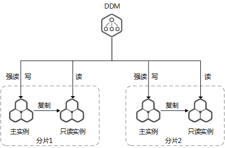

# 读写分离

DDM服务实现了自动读写分离，用户购买了RDS只读实例后，将只读实例信息同步到DDM中即可，无需再做其他配置。

DDM支持用户在SQL中自定义读写分离策略。

同时DDM还支持在管理控制台配置RDS读策略。

数据库中对计算和缓存资源消耗较多的往往是密集或复杂的SQL查询。当系统资源被查询语句消耗，反过来会影响数据写入操作，进而导致数据库整体性能下降，响应缓慢。因此，当数据库CPU和内存资源占用居高不下，且读占比较高时，可以为数据库添加只读实例。

添加只读实例的作用有以下：

-   将查询非事务性查询SQL路由到只读实例中执行，主实例上执行事务性SQL，在很大程度上缓解主实例上的S锁与X锁的竞争。
-   对只读实例上的表可配置不提供事务支持的数据库引擎，进而提升查询效率。
-   增加只读实例，也相当于数据库横向扩展，直接增加负载能力，同时增加数据冗余，确保数据库高可用。

**图 1**  读写分离示意图  

> **说明：**   
>DDM在一个RDS实例上创建多个分片。  
>为了方便描述，上图假设一个DDM实例在RDS实例上只创建一个分片。  

