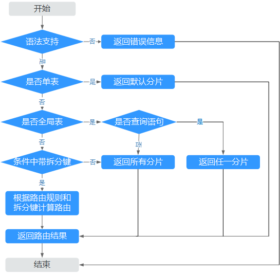

# 路由分发

在分布式数据库中，路由分发的作用即将SQL语句进行解析，并转发到正确的分片上，保证SQL执行后得到正确的结果，并且节约QPS资源。

例如：订单支付系统包含了shard0、shard1、shard2三个分片，订单号2017010112345678的订单数据存储在shard0分片上，则应该将以下语句路由分发到shard0分片上执行。

select Customer, OrderStatus, CreateDate from Order

where OrderId = '2017010112345678';

如果同时路由分发到shard0、shard1、shard2三个分片，会造成多余的查询，浪费资源；如果路由到shard1、shard2分片，则得不到正确的返回结果。

DDM对单张表的路由解析流程如下：

**图 1**  单张表的路由解析流程  

